<a id="top"></a>

# 🌍 国际结算复习笔记

---

## 🗺️ 目录导航

| 模块 | 内容 | 快速跳转 |
|---|---|---|
| 🧭 总体框架 | 课程知识树、复习路线 | [进入](#overview) |
| 🌍 第一章 | 国际结算绪论、结算方式、清算系统 | [进入](#ch1) |
| 💳 第二章 | 票据性质、票据权利义务、票据功能 | [进入](#ch2) |
| 🧾 第三章 | 汇票定义、必要项目、票据行为、融资 | [进入](#ch3) |
| 🏦 第四章 | 本票、支票及其区别 | [进入](#ch4) |
| 💸 第五章 | 汇款、托收、D/P、D/A、风险防范 | [进入](#ch5) |
| 🔍 重点辨析 | 出票人、付款人、承兑人、收款人关系 | [进入](#roles) |
| 🧑‍⚖️ 案例整理 | 票据案例、托收案例 | [进入](#cases) |
| ✅ 期末速记 | 一句话区分、风险排序、高频考点 | [进入](#exam) |

---

## 🌟 复习路线图

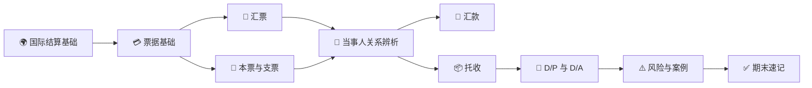

> [!TIP]
> 复习时不要只背定义。建议按这个顺序问自己：**这是什么工具/方式？谁参与？流程怎么走？银行承担不承担付款责任？风险在哪一方？**

---

## 🎨 图例说明

| 图标 | 含义 |
|---|---|
| ⭐ | 高频考点 / 易考点 |
| ⚠️ | 风险点 / 容易出错 |
| ✅ | 结论 / 速记 |
| 🔁 | 流程或循环关系 |
| 👥 | 当事人关系 |
| 🧾 | 票据、单据或凭证 |

---

<a id="overview"></a>

# 🧭 0. 总体框架

> [!IMPORTANT]
> 本课程的核心不是“记很多概念”，而是把 **工具、当事人、流程、风险责任** 串起来。

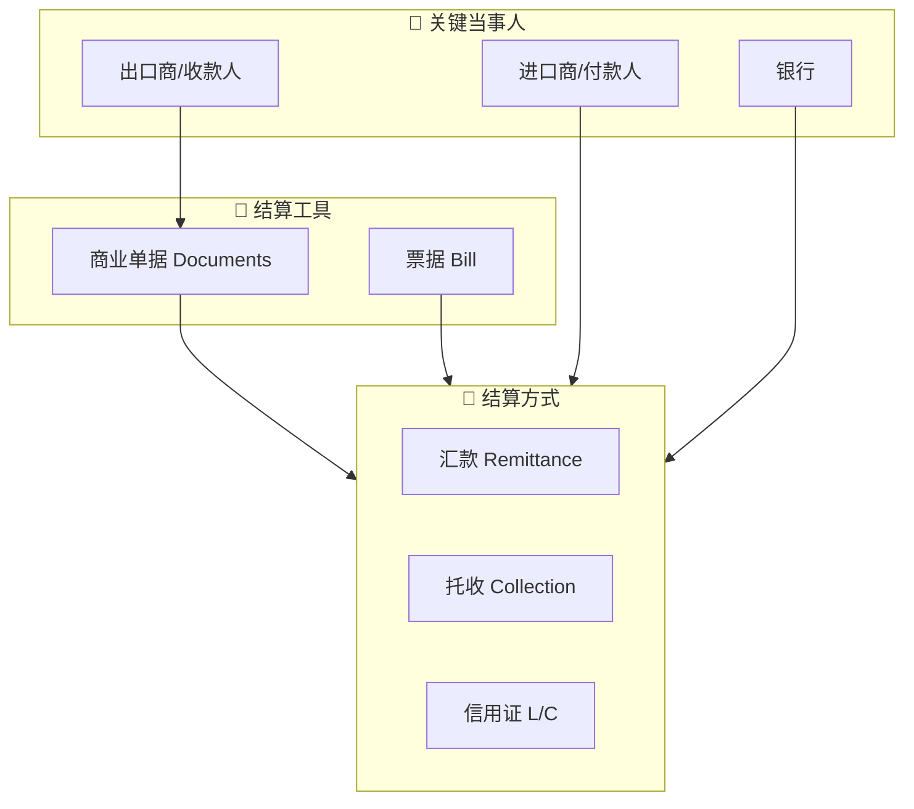

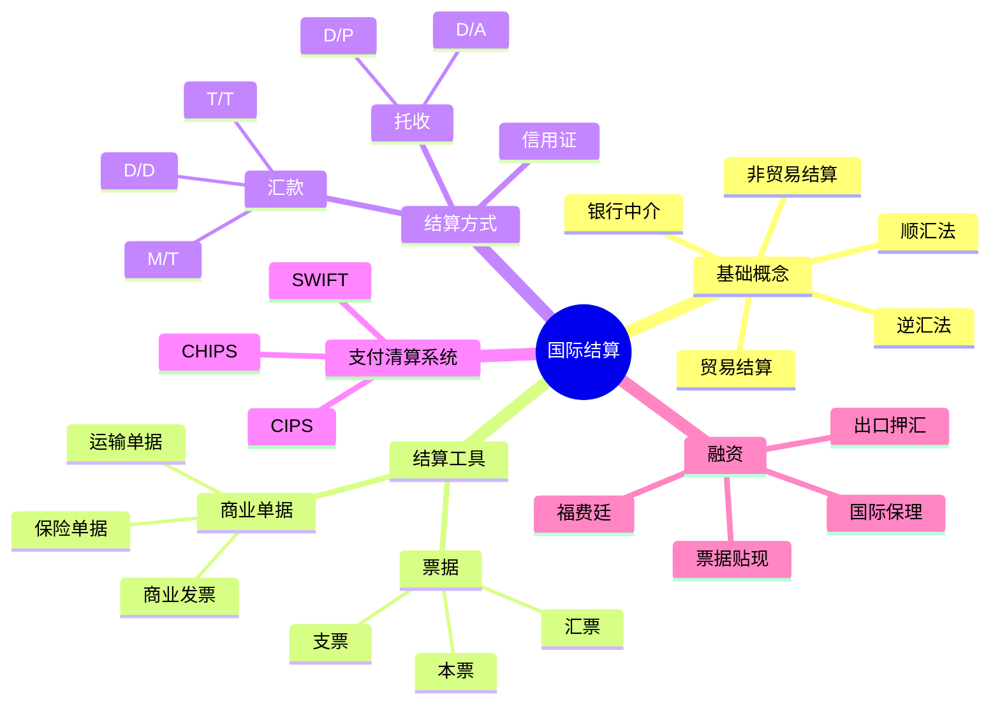

---

<a id="ch1"></a>

# 🌍 1. 第一章：国际结算绪论

## 📌 1.1 国际结算的定义

**国际结算**：国际间由于各种经济交易交往而产生的、以一定货币形式表现的债权债务关系，通过一定支付手段和支付方式进行偿付和清偿的行为。

> [!NOTE]
> 可以把国际结算理解成：**跨国交易产生了债权债务，双方通过银行、票据、单据和支付系统完成清偿**。

国际结算可以分为：

| 类型 | 含义 |
|---|---|
| 贸易结算 | 因货物贸易、服务贸易等产生的跨国收付款 |
| 非贸易结算 | 侨汇、旅游、劳务、投资收益、捐赠等非货物贸易项下收付款 |

课程特点：**实务性、操作性、国际性**。不仅要懂国际贸易业务，还要懂银行结算、票据、单据、规则和融资。

## 🧩 1.2 国际结算学习内容

| 模块 | 内容 |
|---|---|
| 结算工具 | 票据：汇票、本票、支票 |
| 结算方式 | 汇款、托收、信用证；非贸易结算方式 |
| 商业单据 | 基本商业单据：商业发票、运输单据、保险单据；附属商业单据 |
| 附属贸易结算方式 | 银行保函、备用信用证 |
| 融资业务 | 福费廷 Forfeiting、国际保理等 |

## 🧱 1.3 传统结算方式

| 方式 | 英文 | 细分 | 特点 | 常见场景 |
|---|---|---|---|---|
| 汇款 | Remittance | T/T 电汇、M/T 信汇、D/D 票汇 | 手续简单，费用较低，依赖商业信用 | 熟人交易、预付款、尾款、跨境电商等 |
| 托收 | Collection | D/P 付款交单、D/A 承兑交单 | 银行代收但不承担付款保证，风险自担、费用低 | 买卖双方有一定信任但不完全熟悉 |
| 信用证 | Letter of Credit, L/C | 跟单信用证等 | 银行信用担保，较安全但流程复杂、成本高 | 大额交易、陌生交易、风险较高交易 |

## 🔁 1.4 顺汇法与逆汇法

| 分类 | 票据/结算工具流向 | 资金流向 | 典型方式 | 记忆 |
|---|---|---|---|---|
| 顺汇法 | 与资金流向相同 | 付款人 → 收款人 | 汇款 | 钱和指令顺着走 |
| 逆汇法 | 与资金流向相反 | 付款人 → 收款人 | 托收、信用证下汇票 | 票据从收款方发起，逆着资金方向走 |

## 🚀 1.5 国际结算的发展

现代国际结算基本形成于 19 世纪末，变化趋势包括：

- 从现金结算到非现金结算；
- 从凭货付款到凭单付款；
- 从直接结算到以银行为中介的间接结算；
- 国际结算与贸易融资相结合；
- 规则逐渐规范化，形成国际惯例；
- 电子化发展：电子交单、电子单据、eURC、eUCP。

## 🖥️ 1.6 电子化与清算系统

### SWIFT

SWIFT 全称为 Society for Worldwide Interbank Financial Telecommunications，即环球同业银行金融电讯协会。

特点：

- 总部位于比利时布鲁塞尔，并在荷兰阿姆斯特丹、美国纽约设交换中心；
- 联系 200 多个国家和地区的 11000 多家金融机构；
- 提供安全、可靠、快捷、标准化、自动化的银行通讯服务；
- 也可能成为金融制裁工具。

### CHIPS

CHIPS 是美国同业银行收付系统，是纽约清算系统，也是国际美元收付的网络中心。

特点：

- 成立于 1970 年；
- 140 多家成员银行，其中较多为外国成员银行；
- 承担大量国际美元资金结算；
- 采用多边和双边净额轧差机制，实现支付指令实时清算。

### CIPS

CIPS 是人民币跨境支付系统，为境内外参与者提供跨境人民币清算结算服务。

重点：

- 2015 年成立；
- 由中国人民银行依法监督管理；
- 作用是为人民币跨境结算提供基础设施；
- 与 SWIFT、CHIPS 的关系不是完全替代，而是补充并提供更多选择。

## 🌐 1.7 银行海外机构与代理行

| 类型 | 是否独立法人 | 主要特点 |
|---|---|---|
| 分行 Branch Bank | 否 | 总行海外机构，直接开展业务 |
| 子银行 Subsidiary Bank | 是 | 国内银行有控制权 |
| 联营银行 Affiliate Bank | 是 | 国内银行只占部分股份，无法完全控制 |
| 代表处 Representative Office | 否 | 只负责联系、搜集信息，不经营存贷业务 |
| 经理处 Agency | 通常否 | 办理汇款和贷款，限制经营当地存款业务，介于代表处与分行之间的机构 |
| 代理行 Correspondent Bank | 对方银行 | 签署代理行协议，相互提供服务 |

国际结算中，**分行和代理行最重要**。其中代理行关系互利互惠、简单易行，因此实践中使用较多。

## 🧮 1.8 代理行账户关系

| 概念 | 含义 |
|---|---|
| 非账户行 Non-depository Correspondent | 不互设账户，只注明某种货币的各自账户行及账号 |
| 账户行 Depository Bank | 代理行之间开立账户；账户行一定是代理行，但代理行不一定是账户行 |
| 往户账 Nostro Account / Due from Account | 本国银行在境外银行开立的账户，从本国银行角度看是“我方在外账户”，往账通常开立的是境外货币的账户 |
| 来户账 Vostro Account / Due to Account | 境外银行在本国银行开立的账户，从本国银行角度看是“别人存在我这里的账户”，来账通常以本币开立，也可以境外货币开立 |

## 💱 1.9 国际汇兑中的资金偿付

**国际汇兑**：将资金从一家银行调拨到国外另一家银行。

| 当事人 | 含义 |
|---|---|
| 汇出行 | 汇出资金的银行 |
| 汇入行 | 接收资金的银行 |
| 偿付 | 汇出行向汇入行划拨资金头寸，以弥补汇入行垫款的行为 |

**银行 A（汇出行）**发送指令，委托**银行 B（汇入行）**先用自有资金垫付给**公司 C（收款人）**。事后，**银行 A** 将真实的资金头寸划拨给**银行 B** 以填补这笔垫款，这个“A 结算还钱给 B”的动作即为**偿付**。

三种偿付方式：


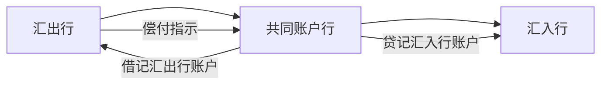


---

<a id="ch2"></a>

### 1. 账户行直接入账
**举例：** 
假设**中国银行（汇出行）**在美国的**花旗银行（汇入行）**开有美元账户。
* 中国银行直接给花旗银行发送报文（偿付指示），授权花旗银行直接从中国银行设立在花旗的美元账户里把钱扣掉（授权借记），从而完成头寸的交割。

---

### 2. 共同账户行转账
**举例：**
假设**工商银行（汇出行）**和**某法国地方银行（汇入行）**没有直接业务往来，但它们都在**纽约的大通银行（共同账户行）**开有美元账户。
* 工行给大通银行发指令，让大通银行从工行的账户里扣款，并存入法国地方银行的账户。随后，大通银行分别给两家银行发送账单，告知账务变动已完成。

---

### 3. 无共同账户行转账
**举例：**
假设**建设银行（汇出行）**的美元代理行是**美国的 A 银行**，而**德国某商业银行（汇入行）**的美元代理行是**美国的 B 银行**。
* 建行通知 A 银行把钱付给 B 银行。A 银行跨行转账给 B 银行后，B 银行再给德国的商业银行发一份贷记账单，告知头寸已安全收到。

# 💳 2. 第二章：票据的性质

## 🎫 2.1 票据概述

票据是用以抵销国际间债权债务的信用工具。

广义票据：各种记载一定文字、代表一定权利的书面凭证，如股票、债券、发票、提单、汇票等。

狭义票据 Bill：出票人委托他人或自己承诺在特定时期向指定人或持票人无条件支付一定款项的书面凭证，是以支付金钱为目的的特定证券。

在本课程中，票据主要指票据法规定的：

- 汇票 Bill of Exchange / Draft
- 本票 Promissory Note
- 支票 Cheque / Check

## ⚖️ 2.2 票据权利与票据义务

| 概念 | 内容 |
|---|---|
| 票据权利 | 持票人向票据债务人请求支付票据金额的权利 |
| 支付请求权 | 主票据权利，也就是直接要求付款的权利 |
| 追索权 | 第二次请求权，票据不获付款或承兑时向前手追偿 |
| 票据义务 | 票据债务人根据票据承担的付款或偿还义务 |
| 一次义务 | 付款义务，主义务 |
| 二次义务 | 偿还义务，从义务，通常是被追索时产生的 |

## 💡 2.3 票据的性质

| 性质 | 英文 | 含义 | 复习重点 |
|---|---|---|---|
| 设权性 | - | 票据权利以票据设立为前提 | 没有票据，就没有票据上的权利义务 |
| 无因性 | Non-causative Nature | 无须过问原因，票据关系成立后，与基础关系相分离 | 善意持票人受保护，不能随便用买卖合同纠纷抗辩 |
| 流通性 | Negotiability | 票据权利可通过背书或交付转让 | 无需通知债务人，保护善意付对价持票人 |
| 要式性 | Requisite in Form | 必须具备法定形式和必要项目 | 形式不合格可能导致无效 |
| 提示性 | Presentment | 持票人请求付款时必须提示票据 | 见票、承兑、付款都与提示有关 |
| 返还性 | Returnability | 付款后应将票据交还付款人 | 票据不能无限期流通 |

### ⭐ 重点：票据无因性

票据关系虽然通常基于买卖、借贷等原因关系产生，但票据一经成立并投入流通，票据关系就与基础关系相分离。票据债务人原则上不得以自己与出票人或持票人前手之间的抗辩事由，对抗善意并付对价的持票人。票据产生的原因是票据的基本关系：1.出票人与付款人之间的资金关系 2.出票人与收款人，以及票据的背书人与被背书人之间的对价关系。

## 🛠️ 2.4 票据的功能

| 功能 | 内容 |
|---|---|
| 汇兑功能 | 简单、方便、迅速、安全地实现货币兑换和资金转移 |
| 结算功能 | 用票据清偿或抵消债权债务，是票据基本功能 |
| 信用功能 | 债务人开出的保证债权人权利实现的信用凭证 |
| 流通功能 | 可以通过交付或背书连续转让，节约现金并扩大流通手段 |
| 融资功能 | 通过远期票据贴现、再贴现或抵押贷款获得资金 |

## 📚 2.5 票据法律系统

| 法系 | 代表规则 |
|---|---|
| 英美法系 | 1882 年英国《票据法》Bills of Exchange Act；英国、爱尔兰、美国及部分英联邦国家 |
| 大陆法系 | 1930 年日内瓦公约、《日内瓦统一法》 |
| 中国 | 1995 年《中华人民共和国票据法》，2004 年修改；《票据管理实施办法》更偏操作层面 |

---

<a id="ch3"></a>

# 🧾 3. 第三章：汇票

## 📖 3.1 汇票定义

我国《票据法》：汇票是出票人签发的，委托付款人在见票时或者在指定日期无条件支付确定金额给收款人或者持票人的票据。

英国票据法强调：汇票是一人向另一人签发的、要求即期、定期或在可以确定的将来时间向特定人、其指定人或来人无条件支付一定金额的命令。

**一句话记忆：汇票 = 出票人向付款人发出的无条件付款命令。**

## 👥 3.2 汇票基本当事人

| 中文 | 英文 | 作用 |
|---|---|---|
| 出票人 | Drawer | 签发汇票，发出付款命令的人 |
| 付款人 / 受票人 | Drawee | 被命令付款的人；远期汇票承兑后成为承兑人 |
| 收款人 | Payee | 有权收取票款的人 |
| 持票人 | Holder | 当前合法占有票据并享有票据权利的人 |
| 承兑人 | Acceptor | 对远期汇票作出承兑，承诺到期付款的人 |

## 🧷 3.3 汇票必要项目

| 项目 | 内容 | 注意点 |
|---|---|---|
| “汇票”字样 | Bill of Exchange / Exchange / Draft | 我国与日内瓦统一法要求；英国法不一定要求 |
| 无条件支付命令 | Unconditional Order to Pay | 英文支付文句应用祈使句，不能附条件 |
| 出票地点和日期 | Place and Date of Issue | 影响行为能力、到期日、有效期；出票地法律很重要 |
| 付款期限 | Tenor | 即期、出票后定期、见票后定期、定日、延期付款 |
| 收款人名称 | Payee | 限制性抬头、指示性抬头、来人抬头 |
| 确定金额 | Certain in Money | 大小写不一致：英美/日内瓦以大写为准，中国法下可能无效，英国票据法可以分期付款，日内瓦和中国的不行 |
| 付款人名称和付款地点 | Drawee and Place of Payment | 付款人就是受票人，英文常以 To 开头，汇票的承兑、付款等行为都适用付款地法律 |
| 出票人名称和签章 | Drawer Name and Signature | 无签章或伪造签章，可能导致无效，个人签名附上职务表明代理公司开出 |

## 🔎 3.4 支付命令是否“无条件”的判断

| 表述 | 是否合格 | 原因 |
|---|---|---|
| Pay to C Co. or order the sum of USD 1000 only | 合格 | 无条件付款命令 |
| provided that the goods are up to standard | 不合格 | 付款附加了货物质量条件 |
| out of the proceeds in applicant’s account | 不合格 | 付款来源受限制 |
| and charge/debit the same to No. ×× account | 一般可接受 | 只是记账指示，不构成付款条件 |
| 付购设备款 50 万美元 | 不宜作为支付命令 | 表达为原因或用途，容易破坏无条件性 |

## 📅 3.5 付款期限与到期日算法

付款期限 Tenor 常见类型：

- 即期：At Sight / On Demand / On Presentation
- 出票后定期：At a Fixed Period After Date
- 见票后定期：At a Fixed Period After Sight
- 定日：At a Fixed Date
- 延期付款：Deferred Payment

到期日计算惯例：

1. 算尾不算头；
2. 月为日历月；
3. 半月按 15 天计算；
4. 先算整月，后算半月；
5. 节假日顺延。

### ［例6］按天数计算
**题目：** 规定付款期限为“At 90 days after sight”的汇票，若其承兑日为当年10月3日，付款到期日是哪天？
*   **计算过程（算尾不算头）：** 
    * 10月份剩余天数：31 - 3 = 28 天
    * 11月份天数：30 天
    * 12月份天数：31 天
    * 已累计：28 + 30 + 31 = 89 天
    * 距离90天还差1天，即跨入次年的1月1日。
*   **答案：** **次年1月1日**。*(注：根据“节假日顺延”规则，1月1日元旦为法定节假日，实际付款日将顺延至元旦后的第一个营业日。)*

**补充题目：** 如果将“after”改为“from”，付款到期日是哪天？
*   **计算过程：** 在国际票据惯例中，“from”（从...起）与“after”（在...之后）的起算规则一致，均适用“算尾不算头”原则，即不计入出票/承兑当日。
*   **答案：** 依然是 **次年1月1日**（遇节假日顺延）。

---

### ［例7］按日历月计算（无对应日期处理）
**题目：** 规定付款期限为“At 1 month after 30th Jan.”的汇票，其付款到期日是哪天？
*   **计算过程（月为日历月）：** 从1月30日往后推1个日历月是2月份。由于2月份（平年28天，闰年29天）没有30号，按惯例应以该月的最后一天为准。
*   **答案：** **当年2月28日**（若遇闰年则为2月29日）。

**补充题目：** 如果将“1 month”改为“2 months”，付款到期日是哪天？
*   **计算过程：** 从1月30日往后推2个日历月是3月份。3月份有31天，存在30号。
*   **答案：** **当年3月30日**。

---

### ［例8］整月与半月混合计算
**题目：** 规定付款期限为“At 3 and a half month after 15th Feb.”的汇票，其付款到期日是哪天？
*   **计算过程（先算整月，后算半月；半月按15天）：** 
    * 先算整月：2月15日往后推3个月 $\rightarrow$ 5月15日。
    * 后算半月：5月15日再加15天 $\rightarrow$ 5月30日。
*   **答案：** **当年5月30日**。

**补充题目：** 如果将起算日“15th Feb.”改为“18th April”，付款到期日是哪天？
*   **计算过程：**
    * 先算整月：4月18日往后推3个月 $\rightarrow$ 7月18日。
    * 后算半月：7月18日再加15天。因为7月有31天，7月剩余时间为 31 - 18 = 13天。15 - 13 = 2天，因此跨入8月份的第2天。
*   **答案：** **当年8月2日**。

## 🏷️ 3.6 收款人抬头

| 抬头类型 | 英文 | 示例 | 是否可转让 |
|---|---|---|---|
| 限制性抬头 | Restrictive Order | Pay to C Co. only / not transferable | 不可转让或受限制 |
| 指示性抬头 | Demonstrative Order | Pay to the order of C Co. / Pay to C Co. or order | 可背书转让 |
| 来人抬头 | Payable to Bearer | Pay to bearer | 英国法允许；我国和日内瓦统一法不允许 |

## 📝 3.7 汇票附加记载

常见附加记载：

- 汇票编号 Number of Exchange
- 出票条款 Drawn Clause，如 drawn under L/C No. ...
- 付一不付二 Pay this First of Exchange, Second of Exchange being unpaid
- 担当付款人 Person Designated as Payer
- 预备付款人 Referee in Case of Need
- 对价条款 Value Clause
- 托收条款 Collection Clause
- 免作退票通知或拒绝证书 Notice of Dishonor Excused / Protest Waived
- 无追索权 Without Recourse

## 🎬 3.8 汇票行为

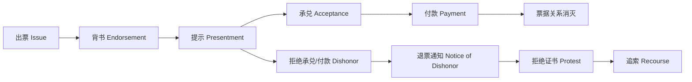

### 3.8.1 出票 Issue

出票是出票人签发汇票并将其交付给他人的行为。

要点：

- 出票人制作汇票并签字；
- 签字使汇票生效；
- 出票人将汇票交付给收款人或他人；
- 出票以创设票据权利义务为目的。

### 3.8.2 背书 Endorsement

背书是在汇票背面或粘单上签字并交付给被背书人的行为。

有效背书条件：

- 制作在汇票背面或粘单上；
- 转让全部金额；
- 背书连续。

背书类型：

| 类型 | 英文 | 含义 |
|---|---|---|
| 特别背书 / 完全/记名背书 | Special Endorsement | 有背书人签字并写明被背书人 |
| 空白背书 / 无记名背书 | Blank Endorsement | 只有背书人签字，不注明被背书人，或转让给来人 |
| 限制性背书 | Restrictive Endorsement | 限制被背书人再转让，只能凭票取款 |
| 附条件背书 | Conditional Endorsement | 背书带条件；条件只约束背书人与被背书人 |
| 托收背书 | Endorsement for Collection | 被背书人只获得代理收款权，不发生权利转让 |
| 设质背书 | Endorsement in Pledge | 在票据权利上设定质权 |
| 回头背书 | Reversed Endorsement | 以票据债务人为被背书人，权利可能受限制 |

### 3.8.3 提示 Presentment

提示是持票人向付款人出示汇票，要求承兑或付款的法律行为。

| 类型 | 含义 | 期限重点 |
|---|---|---|
| 提示承兑 | 向付款人要求承兑 | 远期汇票通常出票日起 1 个月内 |
| 提示付款 | 向付款人要求付款 | 即期汇票通常 1 个月内；远期汇票到期日起 10 天内提示付款 |

### 3.8.4 承兑 Acceptance

承兑是远期汇票的付款人在汇票正面签章，表示同意按出票人命令到期付款，并将汇票交还持票人的票据行为。

承兑要项：

- “Accepted”字样；
- 承兑日期；
- 承兑人名称；
- 承兑人签字或签章。

承兑类型：

| 类型 | 英文 | 含义 |
|---|---|---|
| 普通承兑 | General Acceptance | 完全按照汇票内容承兑 |
| 限制性承兑 | Qualified Acceptance | 对承兑内容作限制 |
| 有条件承兑 | Conditional Acceptance | 承兑附条件 |
| 部分承兑 | Partial Acceptance | 只承兑部分金额 |
| 限制地点承兑 | Local Acceptance | 限定付款地点 |
| 延长付款时间承兑 | Qualified Acceptance as to Time | 延长付款时间 |

### 3.8.5 付款 Payment

付款是付款人支付票据金额，使票据债权债务关系消灭的行为。

正当付款条件：

1. 在汇票到期日或以后付款；
2. 由付款人或承兑人支付；
3. 向持票人支付；
4. 善意支付。

我国《票据法》，执行付款人必须于提示付款当日内足额付款。

### 3.8.6 退票、退票通知、拒绝证书

| 概念 | 英文 | 含义 |
|---|---|---|
| 退票 / 拒付 | Dishonor | 拒绝承兑或拒绝付款 |
| 退票通知 | Notice of Dishonor | 票据遭拒付时，持票人或背书人通知前手和出票人 |
| 拒绝证书 | Protest | 公证机关或有权机构出具的证明退票事实的法律文件 |

### 3.8.7 追索 Recourse

追索是汇票不获承兑、不获付款或出现其他法定原因时，持票人在履行保全手续后，向前手背书人、出票人要求清偿票据金额和费用的行为。

期限重点：

| 权利 | 期限 |
|---|---|
| 持票人对出票人和承兑人的权利 | 即期汇票自出票日起 2 年；远期汇票自付款到期日起 2 年 |
| 持票人对前手的追索权 | 自被拒付日起 6 个月 |
| 再追索权 | 自清偿日或被起诉日起 3 个月 |

### 3.8.8
参加承兑（Acceptance for Honor）

在汇票未获承兑或者未获付款后，非汇票债务人在征得持票人同意的情况下，参加承兑已遭拒绝承兑的汇票的一种附属票据行为。

参加付款（Payment for Honor）

在因拒绝付款而退票，并已作成拒绝付款证书的情况下，非票据债务人可以参加支付汇票票款。

保证（Guarantee）

汇票的保证是指票据债务人以外的第三者，为担保特定票据债务人履行债务而自愿承担同一内容的票据债务的票据行为。

既有从属性又与独立性

## 💰 3.9 汇票在融资中的运用

### 3.9.1 贴现 Discount

贴现是持票人在票据到期前，为获取现款，向银行贴付一定利息所作的票据转让。

公式：

```text
贴现净值 = 到期价值 - 贴现利息
贴现息 = 票面金额 × 贴现率 × 贴现天数 / 360 或 365
```

注：美元一般按 360 天，英镑一般按 365 天。

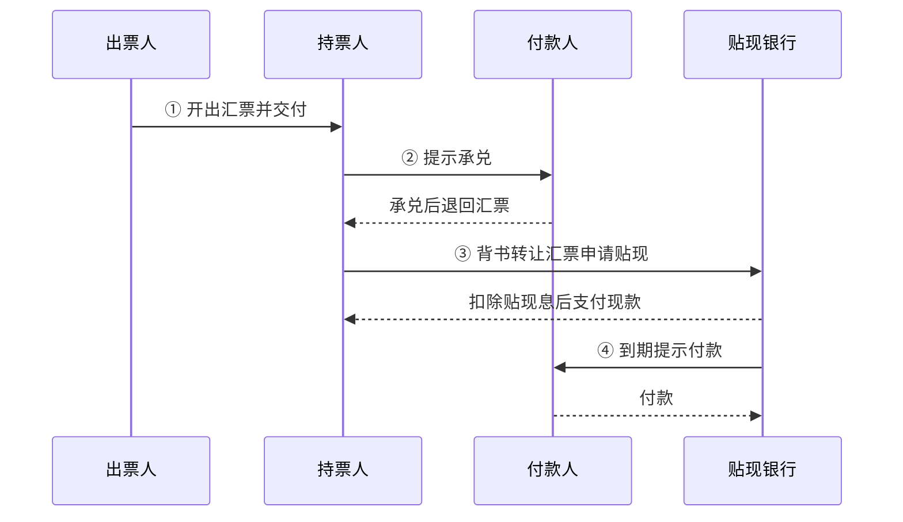

影响汇票身价与贴现率的因素：

- 出票人和承兑人的信用地位；
- 汇票起源交易是否可靠；
- 是否注明根据信用证出具，如 `drawn under ...`；
- 承兑费、印花税、贴现率等费用。

### 3.9.2 汇票融通 Accommodation

汇票融通是指一人为了帮助另一人获得资金融通，在没有从后者收取对价的情况下，以出票人、承兑人或背书人身份在汇票上签字，使对方能够以持票人身份转让票据筹集资金。

| 当事人 | 含义 |
|---|---|
| 融通人 Accommodation Party | 签字提供信用帮助的人 |
| 被融通人 Accommodated Party | 接受帮助的持票人 / 筹资者 |

中国票据法要求票据签发和取得具有真实交易关系和债权债务关系，原则上禁止无真实交易基础的融通票据。

例：A公司欲融通资金，得到了经营融通票据业务的B银行的承兑信用额度的承诺后，A公司作为该汇票的出票人，同时又是收款人，B银行在汇票上承兑，成为该汇票的主债务人。利用B银行的信誉，A公司得以在金融市场上将汇票贴现，获得所需资金，其金额为汇票的面值扣减至到期日的贴现息。然后，在汇票到期日之前，A公司将足额票款交付B银行。受让汇票的贴现银行于汇票到期日向承兑人B银行提示，B银行即偿付票款。

本例中B银行为融通人，A公司为被融通人（即筹资者），所开立的汇票为无对价关系的融通票据。B银行向A公司授信而无需提供资金，但可收取承兑手续费；A公司利用B银行的信用筹措到所需资金，付出的代价是贴现息和承兑费用；而贴现银行所获得的利益是贴现息。

## 🗂️ 3.10 汇票分类

| 分类标准 | 类型 |
|---|---|
| 按付款时间 | 即期汇票 Sight Bill：见票即付或没有规定付款期限；远期汇票 Time Bill：将来支付；承兑 |
| 按出票人身份 | 银行汇票 Banker’s Draft：出票人和付款人都是银行，风险小；商业汇票 Trader’s Draft：非银行签发的汇票，其付款人可以是银行也可以是非银行 |
| 按承兑人身份 | 银行承兑汇票 Banker’s Acceptance Bill：信用等级高；商业承兑汇票 Trader’s Acceptance Bill |
| 按使用货币 | 本币汇票 Local Currency Bill；外币汇票 Foreign Currency Bill |
| 按流通地域 | 国内汇票 Domestic Bill：出票地与付款地处于同一国家；国际汇票 / 外国汇票 International / Foreign Bill：出票地与付款地分处两国 |
| 按当事人重复性 | 普通汇票；变式汇票 |
| 按附属单据 | 光票 Clean Bill；跟单汇票 Documentary Bill |
| 特殊类型 | 中心汇票：付款人为该货币清算中心银行的即期银行汇票 |

变式汇票：基本当事人重复
1.已付汇票（对己汇票）：出票人同时为付款人；在中国，银行汇票均为对己汇票
2.已受汇票（指己汇票）：出票人同时为收款人；国际贸易中通常使用：出口商发货后签发
3.付受汇票：付款人同时为收款人；对付款人的内部结算比较便利
4.已付已受汇票：出票人、付款人和收款人同为一人；一般用于同一银行的各分行之间签发

光票（Clean Bill）：不附有货运单据、银行汇票多为光票、付款完全凭当事人的信用、在国际贸易中用于支付佣金、代垫费用、收取尾款

跟单汇票（Documentary Bill）：又称押汇汇票或信用汇票、附有货运单据，通常是商业汇票、是国际贸易结算的主要工具

中心汇票例子：如以纽约某银行为美元汇票付款人的汇票，以东京某银行为日元汇票付款人的汇票，以伦敦某银行为英镑汇票付款人的汇票等都是中心汇票。

---

<a id="ch4"></a>

# 🏦 4. 第四章：本票与支票

## 📄 4.1 本票 Promissory Note

我国《票据法》：本票是出票人签发的、承诺自己在见票时无条件支付确定金额给收款人或者持票人的票据。我国票据法所称本票，是指**银行本票**。

**一句话记忆：本票 = 出票人自己承诺付款。**

### 4.1.1 本票必要项目

1. 写明“本票”字样；
2. 无条件支付承诺；
3. 一定金额；
4. 付款期限；
5. 收款人名称；
6. 出票日期和地点；
7. 付款地点；
8. 制票人签字。

### 4.1.2 本票与汇票区别

| 比较项 | 本票 | 汇票 |
|---|---|---|
| 基本性质 | 无条件承诺，已付证券 | 无条件命令或委托，委付证券 |
| 基本当事人 | 制票人、收款人 | 出票人、付款人、收款人 |
| 签发票据人的责任 | 制票人为主债务人 | 出票人通常承担连带责任，承兑后承兑人为主债务人 |
| 份数 | 一式一份 | 可以成套签发 |
| 远期票据程序 | 没有承兑 | 远期汇票需要提示承兑 |
| 退票处理 | 国际本票退票不需拒绝证书 | 国际汇票退票通常需拒绝证书 |

### 4.1.3 本票用途

- 商品交易中的远期付款；
- 金钱借贷凭证；
- 企业向外筹资；
- 银行以即期本票代替现金支付。

### 4.1.4 本票常用形式

| 形式 | 含义 |
|---|---|
| 商业本票 Trader’s Notes | 工商企业为制票人签发的本票 |
| 银行本票 Banker’s Notes | 银行为出票人签发，常用于代替现金支付或转移资金 |
| 国际小额本票 International Money Order | 由货币清算中心银行作为签票行发行 |
| 旅行支票 Traveller’s Cheque | 兼有本票和支票性质 |
| 流通存单 Certificate of Deposit, CD | 大额、固定金额、固定期限存款单证 |

### 4.1.5 中国本票规定

- 本票必须记载收款人名称，否则无效；
- 中国不存在无记名本票，只有记名本票；
- 中国只有银行能签发本票，企业不能签发本票；
- 中国本票均为见票即付，不承认远期本票效力；
- 因此中国本票功能主要是支付工具，信用功能下降。

## 🧾 4.2 支票 Cheque / Check

我国《票据法》：支票是出票人签发的，委托办理支票存款业务的银行或者其他金融机构在见票时无条件支付确定金额给收款人或者持票人的票据。

**一句话记忆：支票 = 银行客户命令开户银行见票即付。**

### 4.2.1 支票必要项目

1. 写明“支票”字样；
2. 无条件支付命令；
3. 付款银行名称和地点；
4. 出票日期与地点；
5. 一定金额；
6. 收款人；
7. “即期”字样，如未写明仍视为见票即付；
8. 出票人签字。

### 4.2.2 支票特点

- 出票人必须是银行存款户；
- 出票人必须在银行有足够存款；
- 出票人与银行签有使用支票协议；
- 支票为见票即付，不需要承兑；
- 主要是支付工具，不具备明显信用功能；
- 付款人仅限银行或其他金融机构；
- 通常出票人为主债务人；
- 提示付款有合理期限。

### 4.2.3 支票种类

| 分类标准 | 类型 | 含义 |
|---|---|---|
| 按抬头 | 记名支票 | 抬头注明收款人名称 |
| 按抬头 | 无记名支票 / 来人支票 | 空白或来人支票；中国法允许未记载收款人，经授权可补记 |
| 变式支票 | 对己支票 | 出票人和付款人为同一当事人，只能银行等金融机构签发 |
| 变式支票 | 指己支票 | 出票人和收款人为同一当事人 |
| 变式支票 | 受付支票 | 付款人为收款人，收款人也只能是金融机构 |
| 按支付方式 | 现金支票 | 只用于支取现金 |
| 按支付方式 | 转账支票 | 只用于转账 |
| 按保障 | 普通支票 | 无“现金”或“转账”等特殊限制 |
| 按保障 | 划线支票 Crossed Cheque | 收款人只能委托银行收款，不能直接取现 |
| 按保障 | 保付支票 Certified Cheque | 银行记载“照付/保付”等并签名后承担付款责任；中国票据法未规定 |

### 4.2.4 划线支票

| 类型 | 含义 |
|---|---|
| 普通划线支票 | 不注明收款银行，收款人可通过任何银行收款 |
| 特殊划线支票 | 平行线中注明收款银行，只能通过指定银行收款 |
| Not Negotiable | 出票人仅对收款人负责，转让后对后手不负责 |
| Account Payee | 收款银行只能将票款记入收款人账户，不得直接付现 |

出票人、背书人或者持票人均可以在支票上记载平行线，其效力相同。
平行线要记载于支票的正面，记载于支票背面无效。实务中，通常记载于支票正面的左上角。


### 4.2.5 支票止付与退票

支票止付 Countermand：在支票解付以前撤销付款。我国票据法没有专门规定支票止付，但票据遗失时，失票人可通知付款人挂失止付，并通过法律程序保全权利。

支票退票原因：

- 空头支票；
- 超过合理提示期限；
- 背书欠缺或不连续；
- 出票人签章不符合预留式样；
- 破损支票；
- 大小写金额不符；
- 必要记载不符合规定。

### 4.2.6 空头支票后果

签发空头支票或签发与预留签章不符的支票，不以骗取财物为目的的，由中国人民银行对出票人处以票面金额 5% 但不低于 1000 元罚款；持票人有权要求出票人赔偿支票金额 2% 的赔偿金。

### 4.2.7 支票与汇票区别

| 项目 | 支票 | 汇票 |
|---|---|---|
| 出票人/付款人 | 出票人是银行客户，付款人为开户银行 | 出票人、付款人可以是不受限定的任何人 |
| 性质 | 授权书，支付工具 | 委托书，支付和信用工具 |
| 付款期限 | 只有即期付款，无承兑，无到期日记载 | 有即期和远期，可记载到期日 |
| 主债务人 | 通常是出票人 | 出票人或承兑人 |
| 保证付款 | 可以保付 | 无保付，但可有第三者保证 |
| 撤销 | 可以止付 | 承兑后不可撤销 |
| 份数 | 只能开一张 | 可以开一套 |
| 特殊行为 | 无参加承兑、参加付款 | 汇票有时有参加承兑、参加付款 |

---

<a id="ch5"></a>

# 💸 5. 第五章：汇款与托收

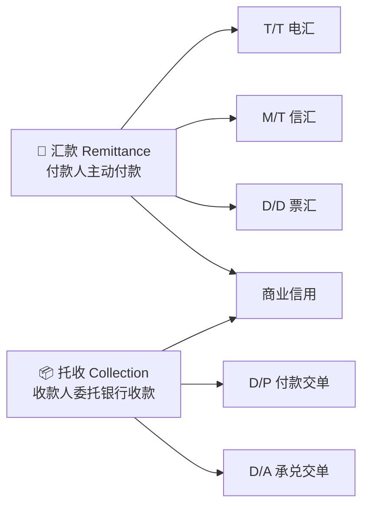

> [!WARNING]
> 汇款和托收都主要建立在**商业信用**基础上，银行通常只是办理或代收，不等于替进口商保证付款。

## 💌 5.1 汇款 Remittance

汇款又称汇付，是银行应付款人要求，以一定方式将款项通过国外联行或代理行交付收款人的结算方式。

### 5.1.1 汇款基本当事人


| 当事人 | 英文 | 作用 |
|---|---|---|
| 汇款人 | Remitter | 提交汇款申请书，付款方 |
| 汇出行 | Remitting Bank | 接受汇款申请，发出付款指示 |
| 汇入行 / 解付行 | Paying Bank | 按指示向收款人解付款项 |
| 收款人 | Payee | 最终收款人 |

### 5.1.2 汇款种类

| 方式 | 英文 | 工具 | 优点 | 缺点 |
|---|---|---|---|---|
| 电汇 T/T | Telegraphic Transfer | 电报、电传、SWIFT，加押密押证实 | 速度最快，安全性高 | 费用较高 |
| 信汇 M/T | Mail Transfer | 信汇委托书或支付委托书 | 费用较低 | 速度慢，安全性低于电汇 |
| 票汇 D/D | Demand Draft | 银行即期汇票 | 灵活，费用较低 | 汇票可能丢失、毁损；流程与前两者不同 |

### 5.1.3 电汇 / 信汇流程

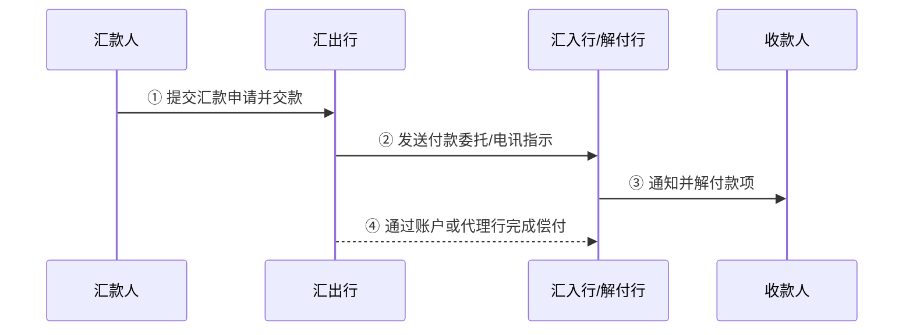

### 5.1.4 票汇 D/D 流程

票汇与电汇、信汇的关键区别：**汇出行不是直接通知汇入行付款，而是开出以汇入行为付款人的银行即期汇票交给汇款人。**

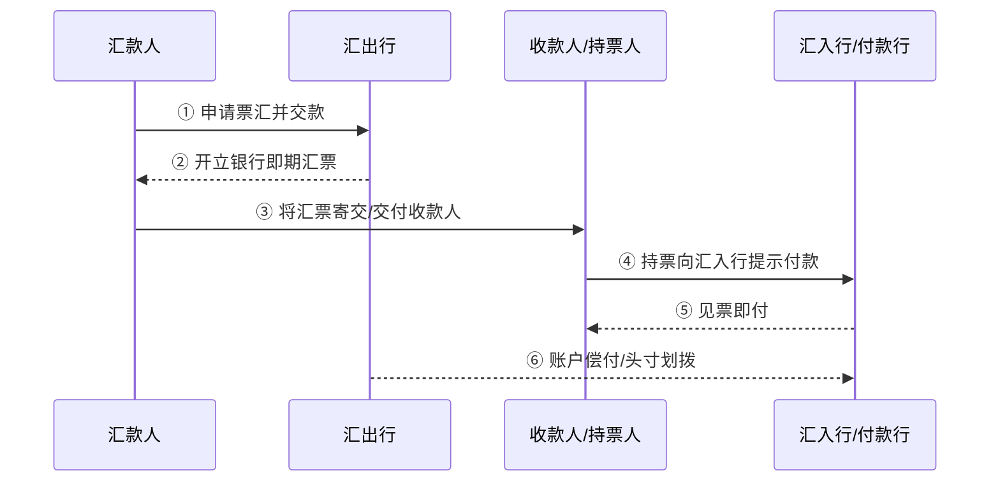

### 5.1.5 汇款偿付 Cover Instruction

| 情况 | 偿付指示表达 |
|---|---|
| 汇入行在汇出行开有账户 | `In cover, we have credited the sum to your account with us.` |
| 汇出行在汇入行开有账户 | `In cover, please debit our account with you.` |
| 双方在第三方银行均有账户 | `We have authorized Y Bank to debit our account and credit your account with them.` |
| 无直接账户、无共同账户行 | `We have instructed XX Bank to remit proceeds to you.` |

### 5.1.6 汇款退汇

| 方式 | 可退汇情况 |
|---|---|
| 电汇 / 信汇 | 汇款人要求退汇；收款人拒收或通知不到收款人 |
| 票汇 | 汇票未寄出时汇款人可退汇；收款人可将汇票退回汇款人 |
| 票汇已流通 | 不论汇出行还是汇入行，一般都不能办理退汇 |

### 5.1.7 汇款在国际贸易中的应用

- 预付货款 Payment in Advance；
- 货到付款 Payment after Arrival of the Goods；
- 赊账交易 Open Account Transaction；
- 延期付款 Deferred Payment；
- 售定 Goods Sold；
- 寄售 Consignment：出口商出运时尚无明确买家，委托国外经销商代理销售，对卖方而言是较差收款条件。

### 5.1.8 汇款特点

- 结算基础是商业信用；
- 银行只是受托办理，不承担货物买卖和货款收付风险；
- 汇出行对邮递过程延误、遗失及邮电部门过失不承担责任；
- 风险和资金负担不平衡；
- 缺乏相关融资手段；
- 手续简单、费用低。

## 📦 5.2 托收 Collection

托收是收款人或债权人为取得因劳务、商品及其他交易引起的应收款项，将有关单据交给本地银行，委托银行通过国外代理行向付款人或债务人交单取款的业务。

| 类型 | 含义 |
|---|---|
| 光票托收 | 金融单据托收，一般用于尾款、代垫费用、佣金、样品费等 |
| 跟单托收 | 伴随商业单据的托收，是国际贸易中更常见的形式 |

### 5.2.1 托收基本当事人

| 当事人 | 英文 | 责任 |
|---|---|---|
| 委托人 | Principal | 通常为出口商；承担贸易合同责任和委托代理合同责任 |
| 托收行 | Remitting Bank | 审查申请书和单据，缮制托收委托书，按常规处理并承担过失责任 |
| 代收行 | Collecting Bank | 审查委托书和单据，保管单据，反馈托收情况，谨慎处理货物 |
| 提示行 | Presenting Bank | 向付款人提示，接受付款或承兑并交单；实务中常由代收行兼任 |
| 付款人 | Drawee | 通常为进口商；履行贸易合同付款义务，不得无故延迟或拒付 |

## 🔐 5.3 跟单托收交单条件

### 5.3.1 D/P 付款交单 Documents against Payment

付款交单是指代收行以进口商付款为条件向进口商交单。

#### D/P 即期流程

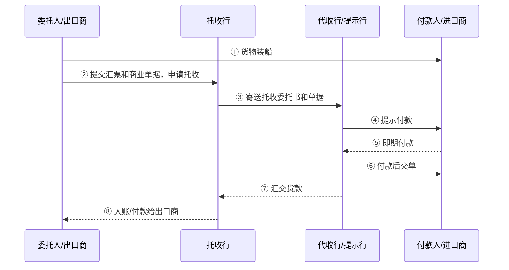

#### D/P 远期流程

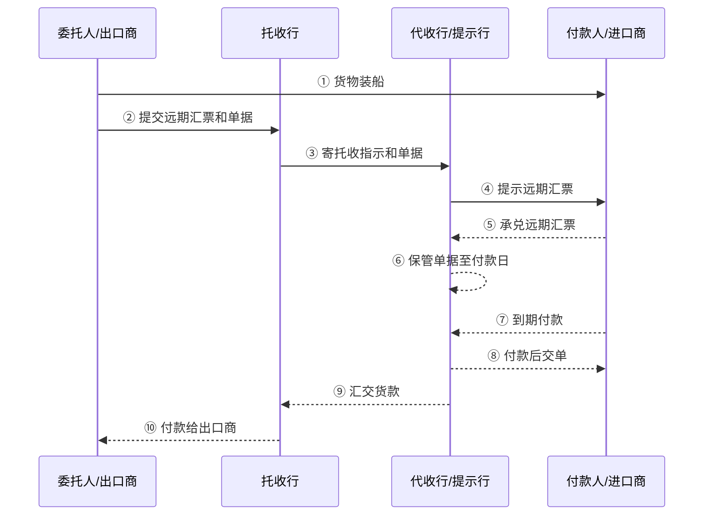

重点：D/P 远期虽然有远期汇票和承兑环节，但**单据原则上仍应在付款后才交给进口商**。

### 5.3.2 D/A 承兑交单 Documents against Acceptance

承兑交单是指代收行在进口商承兑远期汇票后，即向进口商交单。

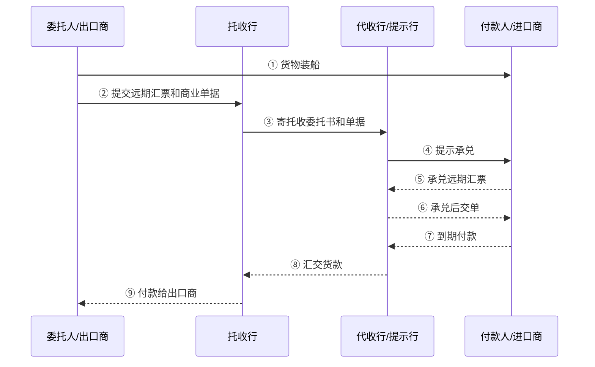

> [!TIP]
> 判断 D/P 和 D/A 的关键不是“有没有远期汇票”，而是：**进口商拿到单据之前，是否已经付款？**  
> - 已付款才交单：D/P  
> - 只承兑就交单：D/A

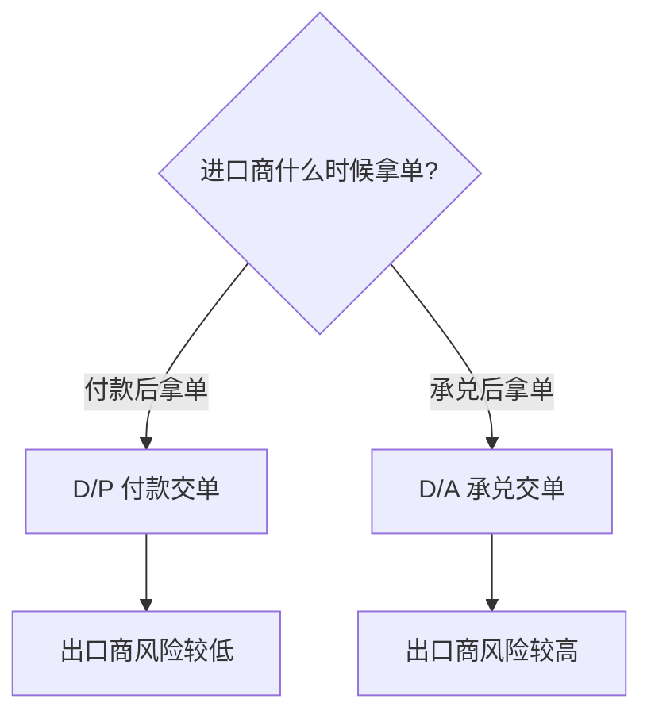

### 5.3.3 三种交单条件比较

| 条件 | 汇票 | 出口商风险 | 进口商资金使用效率 | 核心区别 |
|---|---|---|---|---|
| D/P 即期 | 无汇票或即期汇票 | 低 | 较高 | 付款后立即交单 |
| D/P 远期 | 远期汇票 | 低于 D/A，但有操作风险 | 较低 | 承兑后不应交单，到期付款后交单 |
| D/A | 远期汇票 | 高 | 较高 | 承兑后即可取得单据，出口商等到期收款 |

## 🧾 5.4 其他交单条件

| 条件 | 英文 | 风险点 |
|---|---|---|
| 分批部分付款 | Partial Payment | 一部分即期付款，余额承兑远期汇票；适用于分批装运 |
| 凭本票交单 | Delivery against Promissory Note | 最好要求银行本票，商业本票风险较高 |
| 凭付款承诺书交单 | Delivery against Letter of Undertaking to Pay | 属于商业信用，不是金融票据，风险较大 |
| 凭信托收据交单 | Delivery against Trust Receipt, T/R | 常是代收行为进口商提供融资，若不当交单风险可能由银行承担 |
| 凭保函交单 | Delivery against Letter of Guarantee | 银行保函风险小于普通付款承诺书 |

## 👥 5.5 托收汇票当事人及背书

托收汇票中：

- 出票人：出口商 / 卖方；
- 付款人：进口商 / 买方；
- 收款人：可以是出口商、托收行或代收行。

### 情况 1：出口商为收款人

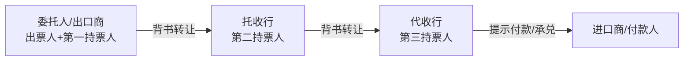

### 情况 2：托收行为收款人

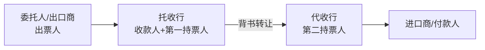

### 情况 3：代收行为收款人

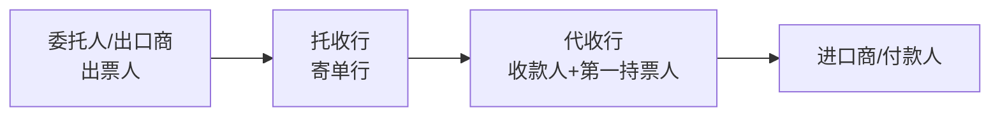

## 🏦 5.6 跟单托收中的资金融通

### 银行对出口商的融资

| 方式 | 含义 |
|---|---|
| 出口押汇 Outward Bills | 出口商将代表物权的提单及其他单据抵押给银行，取得扣除利息和费用后的有追索权垫款 |
| 出口商承兑信用额度 Line of Acceptance Credit for Exporter | 利用融资汇票进行资金融通；出口商为出票人，托收行为付款人 |

### 银行对进口商的融资

- 凭信托收据借单提货；
- 为进口商承兑信用额度；
- 凭银行担保提货。

## ⚠️ 5.7 托收特点与风险

### 托收特点

- 比汇款更安全；
- 结算基础仍是商业信用；
- 资金负担仍不平衡；
- 比汇款手续稍多、费用稍高。

### 出口商风险

托收方式下，出口商发货后主动权掌握在进口商手中，能否收款主要取决于进口商资信。因此出口商风险大于进口商。

防范：

- 认真调查进口商资信；
- 尽量选择 D/P 即期；
- 谨慎使用 D/A 和 D/P 远期；
- 托收指示书写清楚按 URC522 办理；
- 明确交单条件、付款期限、是否允许信托收据放单；
- 关注目的地国家习惯做法。

### 进口商风险

进口商可能付款提货后发现货物与样品或要求不符，甚至是假货，退货困难。

防范：

- 要求检验证书；
- 选择可靠出口商；
- 合同中约定质量、检验、索赔条款；
- 必要时采用信用证或第三方检验。

---

<a id="roles"></a>

# 🔍 6. 重点辨析：出票人、付款人、承兑人、收款人谁能相同？

> [!IMPORTANT]
> 这一部分是复习重点。判断方法：先看票据类型，再看付款责任来自“命令别人付款”还是“自己承诺付款”。

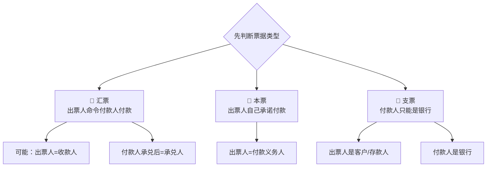

## 🧠 6.1 先记住每种票据的本质

| 票据 | 本质 | 基本当事人 | 是否有承兑 |
|---|---|---|---|
| 汇票 | 出票人命令付款人付款 | 出票人、付款人、收款人 | 远期汇票有承兑 |
| 本票 | 出票人自己承诺付款 | 制票人、收款人 | 没有承兑 |
| 支票 | 银行客户命令开户银行付款 | 出票人、付款银行、收款人 | 没有承兑 |

## 🧾 6.2 汇票中的关系

### 普通汇票

普通汇票中，出票人、付款人、收款人通常三者不同。

```mermaid
flowchart LR
  A[出票人 Drawer] -- 发出付款命令 --> B[付款人 Drawee]
  B -- 付款 --> C[收款人 Payee/持票人]
```

### 付款人与承兑人的关系

- 承兑前：付款人只是被命令付款的人，不一定已经承担最终付款责任。
- 承兑后：付款人在汇票正面签章承兑，成为**承兑人 Acceptor**，通常成为主债务人。
- 所以，**承兑人通常就是已经承兑的付款人**。

### 汇票中可以重复的情况

| 变式 | 哪些人相同 | 说明 |
|---|---|---|
| 对己汇票 / 已付汇票 | 出票人 = 付款人 | 在中国，银行汇票多为对己汇票 |
| 指己汇票 / 已受汇票 | 出票人 = 收款人 | 国际贸易中常见：出口商发货后签发，以自己为收款人 |
| 付受汇票 | 付款人 = 收款人 | 便于付款人内部结算 |
| 已付已受汇票 | 出票人 = 付款人 = 收款人 | 常用于同一银行各分行之间 |

### 哪些“不可能”或“不应乱写”？

严格说，汇票允许多种变式，所以不能简单说出票人、付款人、收款人一定不能相同。真正要注意的是：

1. **承兑人不是一个独立随便找的人**：承兑人应当是付款人承兑后形成的身份。无关第三人不能随便被写成承兑人。  
2. **本票没有付款人/承兑人角色**：因为本票是制票人自己承诺付款，不是命令别人付款。  
3. **支票没有承兑**：支票见票即付，付款人只能是银行或金融机构。  
4. **中国票据法限制某些形式**：如中国本票只有银行本票；中国本票不能是远期本票；汇票来人抬头不被我国票据法承认。

## 📄 6.3 本票中的关系

| 角色 | 说明 |
|---|---|
| 制票人 / 出票人 | 自己承诺付款，是主债务人 |
| 收款人 | 取得票款的人 |
| 付款人 | 本票没有独立付款人，因为制票人自己承担付款承诺 |
| 承兑人 | 本票没有承兑程序，也没有承兑人 |

## 🧾 6.4 支票中的关系

| 角色 | 说明 |
|---|---|
| 出票人 | 银行客户，必须有存款账户 |
| 付款人 | 只能是办理支票存款业务的银行或金融机构 |
| 收款人 | 可为他人，也可为出票人自己，即指己支票 |
| 承兑人 | 支票没有承兑人 |

支票变式：

| 变式 | 哪些相同 | 限制 |
|---|---|---|
| 对己支票 | 出票人 = 付款人 | 只能由银行等金融机构签发 |
| 指己支票 | 出票人 = 收款人 | 中国法允许出票人记载自己为收款人 |
| 受付支票 | 付款人 = 收款人 | 收款人也只能是金融机构 |

---

<a id="cases"></a>

# 🧑‍⚖️ 7. 案例整理

## 🧱 7.1 票据引导案例 1：水泥质量不合格能否拒付？

### 案情

- 8 月 6 日：永固房产向丽德贸易购买水泥 50 万元，签发三个月到期的商业承兑汇票；
- 9 月 19 日：丽德贸易向吉祥木业购买木材 45.5 万元，并将汇票背书转让给吉祥木业；
- 10 月 8 日：发现水泥质量不合格；
- 11 月 6 日：汇票到期，永固房产以水泥质量不合格为由拒付，吉祥木业追索。

### 争议点

永固房产能不能用自己与丽德贸易之间的水泥质量纠纷，对抗吉祥木业这个持票人？

### 结论

原则上不能。票据关系具有无因性，票据关系一经成立并转让，就与原因关系相分离。票据债务人不得以自己与出票人或持票人前手之间的抗辩事由，对抗善意持票人。

### 复习关键词

- 票据无因性；
- 原因关系与票据关系分离；
- 善意持票人保护；
- 票据抗辩限制。

## 🏦 7.2 票据引导案例 2：卖方未交货，承兑银行是否付款？

### 案情

- A 公司从新加坡 B 商人进口 700 万美元胶合板，付款交单，允许分批装运；
- 第一批价值 60 万美元胶合板准时到货，质量良好；
- B 商人提议由 C 银行深圳分行承兑一张见票后一年付款的 700 万美元远期汇票；
- B 商人将该汇票向新加坡的美国 D 银行贴现 600 万美元后消失；
- 一年后，D 银行持汇票向 C 银行深圳分行请求付款；
- A 公司认为 B 商人未交货，不应付款。

### 争议点

C 银行能否以 B 商人未交货为由拒绝向 D 银行付款？

### 结论

不能。D 银行是善意且支付对价的受让人。即使 B 商人未交货，A 公司与 B 商人之间的买卖关系属于原因关系，C 银行不得以原因关系欠缺对抗 D 银行。

### 复习关键词

- 票据关系与基础关系分离；
- 原因关系：A 公司买胶合板；
- 资金关系：A 公司与 C 银行之间的信用/资金安排；
- 善意付对价受让人保护；
- 承兑银行的付款责任。

## ⏰ 7.3 本票案例：过期提示付款，谁承担责任？

### 案情

C 企业持有一张 8 月到期的银行本票，但直到 9 月才向银行请求付款。银行以本票过期为由拒付。C 又向前手 B 请求支付，B 也拒绝。C 起诉 B 和银行。

### 结论

银行应向 C 支付本票金额，但 C 应承担延期取款责任；B 企业免责。

### 理由

C 是正当持票人，但未在法定期限内提示付款，因此其前手背书人 B 不再承担本票付款责任。但是作为本票出票人的银行，不能免除其付款责任。

## 📦 7.4 托收案例 1：D/P 60 天下信托收据放单

### 案情

出口商采用 D/P 60 天方式托收。货到目的港后，付款期限尚未到。买方为了提货销售，经代收行同意，向代收行出具信托收据 T/R，提前取得单据提货。后货物在销售过程中因保管不善被烧毁，买方又倒闭无力付款。

### 问题

责任由谁承担？

### 结论

责任应由代收行承担。D/P 60 天下，代收行应以买方付款为交单条件。代收行在未付款前接受信托收据放单，风险应由代收行承担。

### 复习关键词

- D/P 远期不是 D/A；
- D/P 原则上付款后交单；
- T/R 放单风险；
- 代收行过失责任。

## 🌎 7.5 托收案例 2：D/P 90 天被南美银行当成 D/A

### 案情

A 公司向南美 B 公司出口货物，采用跟单托收 D/P 90 天。到期未收款，且全套单据已在 B 公司承兑汇票后被当地代收行 B′ 银行放给 B 公司。

### 处理

A 公司在托收行配合下，聘请当地律师起诉代收行，认为其将 D/P 远期错误当作 D/A 承兑放单。

### URC522 规则重点

- 托收不应包含凭付款交付商业单据指示的远期汇票；
- 如果托收含远期付款汇票，托收指示书应明确注明 D/A 或 D/P；
- 如果注明凭付款交单，单据只能凭付款交付；
- 代收行对因迟交单据产生的后果可能不负责任。

### 启示

- 原则上应严格遵守 URC522；
- 托收指示中要明确按 URC522 办理；
- 也要尊重当地习惯做法；
- 对南美地区托收业务，尽量采用 D/P 即期或 D/A，避免 D/P 远期；
- 若必须用 D/P 远期，期限应结合从起运地到目的地运输时间设置。

---

<a id="exam"></a>

# ✅ 8. 期末复习速记

## 🗣️ 8.1 一句话区分

| 概念 | 一句话 |
|---|---|
| 汇款 | 付款人主动委托银行把钱汇给收款人 |
| 托收 | 收款人委托银行向付款人收钱 |
| 信用证 | 银行以自身信用保证在单据相符时付款 |
| 汇票 | 出票人命令付款人付款 |
| 本票 | 出票人自己承诺付款 |
| 支票 | 银行客户命令开户银行见票付款 |
| D/P | 付款后交单 |
| D/A | 承兑后交单 |
| 承兑 | 远期汇票付款人承诺到期付款 |
| 背书 | 持票人在票据背面签章并转让票据权利 |
| 追索 | 票据被拒付或拒绝承兑后，持票人向前手追偿 |

## 📊 8.2 风险排序

从出口商角度看，通常：

```text
预付款风险最低 < 信用证 < D/P 即期 < D/P 远期 < D/A < 赊账 / 寄售风险最高
```

从进口商角度看，通常相反：

```text
预付款风险最高，赊账 / D/A 相对有利
```

## 🎯 8.3 高频考点表

| 考点 | 需要会说什么 |
|---|---|
| 票据无因性 | 票据关系与原因关系相分离，保护善意付对价持票人 |
| 汇票必要项目 | 汇票字样、无条件付款命令、出票日期地点、期限、收款人、金额、付款人、出票人签章 |
| 承兑 | 远期汇票付款人承诺到期付款，承兑后成为主债务人 |
| 背书种类 | 特别、空白、限制、附条件、托收、设质、回头背书 |
| D/P vs D/A | D/P 付款后交单；D/A 承兑后交单 |
| D/P 远期风险 | 远期付款但仍应付款后交单；部分地区可能按 D/A 操作，需防范 |
| 本票与汇票 | 本票是承诺，汇票是命令；本票无承兑 |
| 支票与汇票 | 支票付款人限银行，见票即付，无承兑；汇票可远期，可承兑 |
| 汇款特点 | 商业信用、银行不担保、手续简单、费用低、风险不平衡 |
| 托收特点 | 比汇款安全，但仍是商业信用，银行不保证付款 |

## 🧩 8.4 折叠复习卡片

<details>
<summary>⭐ 点击展开：票据无因性怎么记？</summary>

票据无因性是指票据关系一经成立，就与产生票据的基础关系相分离。  
也就是说，基础合同出现问题，不当然影响善意持票人的票据权利。

复习关键词：**基础关系 ≠ 票据关系**。

</details>

<details>
<summary>⚠️ 点击展开：D/P 远期最容易错在哪里？</summary>

D/P 远期中，进口商可以先承兑远期汇票，但原则上仍应在到期付款后才能取得单据。  
不要把 D/P 远期误认为 D/A。

</details>

<details>
<summary>👥 点击展开：承兑人到底是谁？</summary>

承兑人不是一开始就一定存在。  
在远期汇票中，付款人对汇票进行承兑后，才成为承兑人，并承担到期付款的主债务责任。

</details>

## 🧑‍💻 8.5 GitHub 复习建议

建议仓库结构：

```text
international-settlement-notes/
├── README.md                 # 总复习框架
├── notes/
│   ├── ch01-绪论.md
│   ├── ch02-票据性质.md
│   ├── ch03-汇票.md
│   ├── ch04-本票与支票.md
│   └── ch05-汇款与托收.md
└── cases/
    ├── 票据案例.md
    └── 托收案例.md
```

第一次可以先把所有内容放在 `README.md`，后续再拆分章节。


---

<div align="center">

⬆️ [返回顶部](#top)  

**复习提示：流程图先看懂，表格再背，案例最后用来检查自己是否真的理解。**

</div>
