<a id="top"></a>

# 🌍 国际结算复习笔记

---

## 🗺️ 目录导航

| 模块 | 内容 | 快速跳转 |
|---|---|---|
| 🧭 总体框架 | 课程知识树、复习路线 | [进入](#overview) |
| 🌍 第一章 | 国际结算绪论、结算方式、清算系统 | [进入](#ch1) |
| 💳 第二章 | 票据性质、票据权利义务、票据功能 | [进入](#ch2) |
| 🧾 第三章 | 汇票定义、必要项目、票据行为、融资 | [进入](#ch3) |
| 🏦 第四章 | 本票、支票及其区别 | [进入](#ch4) |
| 💸 第五章 | 汇款、托收、D/P、D/A、风险防范 | [进入](#ch5) |
| 🏦 第六章 | 信用证 Letter of Credit | [进入](#ch6) |
| 🔍 重点辨析 | 出票人、付款人、承兑人、收款人关系 | [进入](#roles) |
| 🧑‍⚖️ 案例整理 | 票据案例、托收案例 | [进入](#cases) |
| ✅ 期末速记 | 一句话区分、风险排序、高频考点 | [进入](#exam) |

---

## 🌟 复习路线图

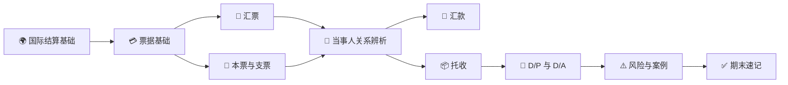

> [!TIP]
> 复习时不要只背定义。建议按这个顺序问自己：**这是什么工具/方式？谁参与？流程怎么走？银行承担不承担付款责任？风险在哪一方？**

---

## 🎨 图例说明

| 图标 | 含义 |
|---|---|
| ⭐ | 高频考点 / 易考点 |
| ⚠️ | 风险点 / 容易出错 |
| ✅ | 结论 / 速记 |
| 🔁 | 流程或循环关系 |
| 👥 | 当事人关系 |
| 🧾 | 票据、单据或凭证 |

---

<a id="overview"></a>

# 🧭 0. 总体框架

> [!IMPORTANT]
> 本课程的核心不是“记很多概念”，而是把 **工具、当事人、流程、风险责任** 串起来。

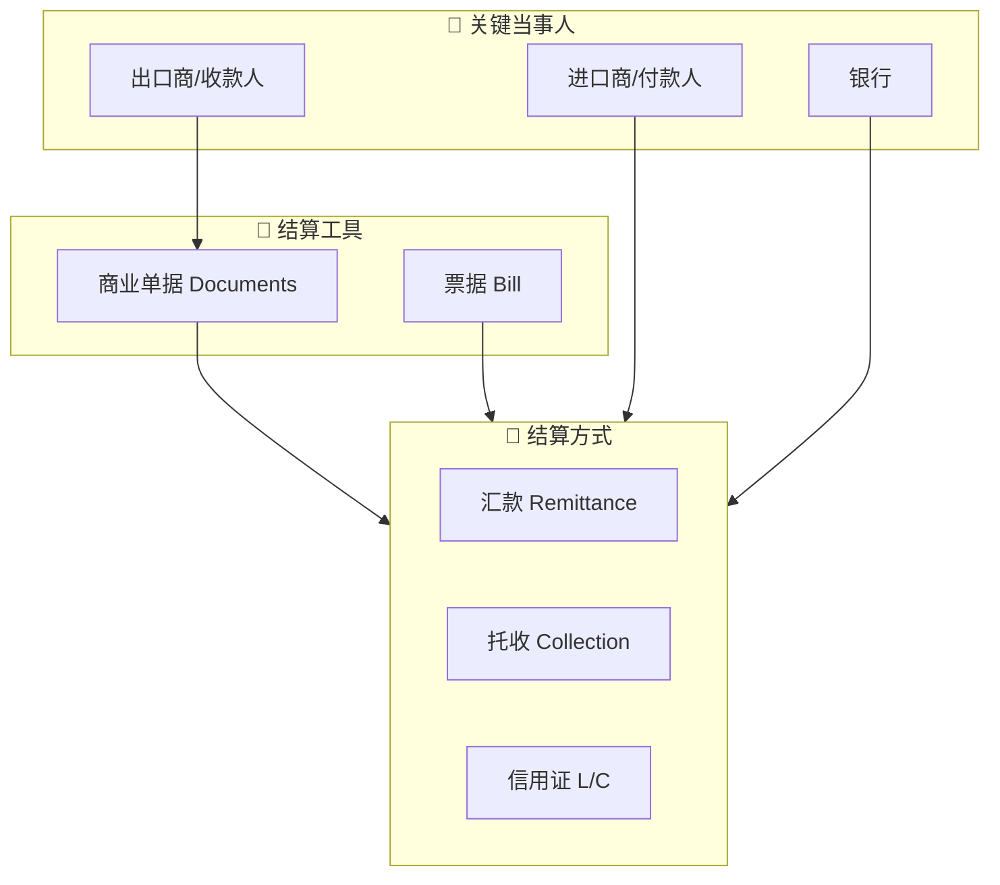

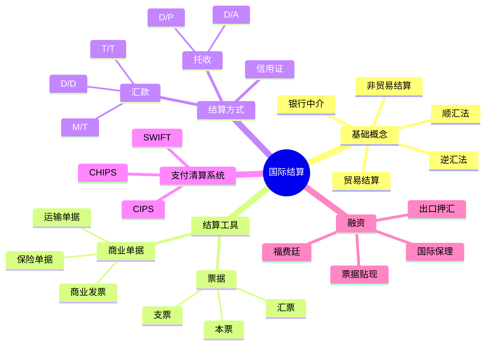

---

<a id="ch1"></a>

# 🌍 1. 第一章：国际结算绪论

## 📌 1.1 国际结算的定义

**国际结算**：国际间由于各种经济交易交往而产生的、以一定货币形式表现的债权债务关系，通过一定支付手段和支付方式进行偿付和清偿的行为。

> [!NOTE]
> 可以把国际结算理解成：**跨国交易产生了债权债务，双方通过银行、票据、单据和支付系统完成清偿**。

国际结算可以分为：

| 类型 | 含义 |
|---|---|
| 贸易结算 | 因货物贸易、服务贸易等产生的跨国收付款 |
| 非贸易结算 | 侨汇、旅游、劳务、投资收益、捐赠等非货物贸易项下收付款 |

课程特点：**实务性、操作性、国际性**。不仅要懂国际贸易业务，还要懂银行结算、票据、单据、规则和融资。

## 🧩 1.2 国际结算学习内容

| 模块 | 内容 |
|---|---|
| 结算工具 | 票据：汇票、本票、支票 |
| 结算方式 | 汇款、托收、信用证；非贸易结算方式 |
| 商业单据 | 基本商业单据：商业发票、运输单据、保险单据；附属商业单据 |
| 附属贸易结算方式 | 银行保函、备用信用证 |
| 融资业务 | 福费廷 Forfeiting、国际保理等 |

## 🧱 1.3 传统结算方式

| 方式 | 英文 | 细分 | 特点 | 常见场景 |
|---|---|---|---|---|
| 汇款 | Remittance | T/T 电汇、M/T 信汇、D/D 票汇 | 手续简单，费用较低，依赖商业信用 | 熟人交易、预付款、尾款、跨境电商等 |
| 托收 | Collection | D/P 付款交单、D/A 承兑交单 | 银行代收但不承担付款保证，风险自担、费用低 | 买卖双方有一定信任但不完全熟悉 |
| 信用证 | Letter of Credit, L/C | 跟单信用证等 | 银行信用担保，较安全但流程复杂、成本高 | 大额交易、陌生交易、风险较高交易 |

## 🔁 1.4 顺汇法与逆汇法

| 分类 | 票据/结算工具流向 | 资金流向 | 典型方式 | 记忆 |
|---|---|---|---|---|
| 顺汇法 | 与资金流向相同 | 付款人 → 收款人 | 汇款 | 钱和指令顺着走 |
| 逆汇法 | 与资金流向相反 | 付款人 → 收款人 | 托收、信用证下汇票 | 票据从收款方发起，逆着资金方向走 |

## 🚀 1.5 国际结算的发展

现代国际结算基本形成于 19 世纪末，变化趋势包括：

- 从现金结算到非现金结算；
- 从凭货付款到凭单付款；
- 从直接结算到以银行为中介的间接结算；
- 国际结算与贸易融资相结合；
- 规则逐渐规范化，形成国际惯例；
- 电子化发展：电子交单、电子单据、eURC、eUCP。

## 🖥️ 1.6 电子化与清算系统

### SWIFT

SWIFT 全称为 Society for Worldwide Interbank Financial Telecommunications，即环球同业银行金融电讯协会。

特点：

- 总部位于比利时布鲁塞尔，并在荷兰阿姆斯特丹、美国纽约设交换中心；
- 联系 200 多个国家和地区的 11000 多家金融机构；
- 提供安全、可靠、快捷、标准化、自动化的银行通讯服务；
- 也可能成为金融制裁工具。

### CHIPS

CHIPS 是美国同业银行收付系统，是纽约清算系统，也是国际美元收付的网络中心。

特点：

- 成立于 1970 年；
- 140 多家成员银行，其中较多为外国成员银行；
- 承担大量国际美元资金结算；
- 采用多边和双边净额轧差机制，实现支付指令实时清算。

### CIPS

CIPS 是人民币跨境支付系统，为境内外参与者提供跨境人民币清算结算服务。

重点：

- 2015 年成立；
- 由中国人民银行依法监督管理；
- 作用是为人民币跨境结算提供基础设施；
- 与 SWIFT、CHIPS 的关系不是完全替代，而是补充并提供更多选择。

## 🌐 1.7 银行海外机构与代理行

| 类型 | 是否独立法人 | 主要特点 |
|---|---|---|
| 分行 Branch Bank | 否 | 总行海外机构，直接开展业务 |
| 子银行 Subsidiary Bank | 是 | 国内银行有控制权 |
| 联营银行 Affiliate Bank | 是 | 国内银行只占部分股份，无法完全控制 |
| 代表处 Representative Office | 否 | 只负责联系、搜集信息，不经营存贷业务 |
| 经理处 Agency | 通常否 | 办理汇款和贷款，限制经营当地存款业务，介于代表处与分行之间的机构 |
| 代理行 Correspondent Bank | 对方银行 | 签署代理行协议，相互提供服务 |

国际结算中，**分行和代理行最重要**。其中代理行关系互利互惠、简单易行，因此实践中使用较多。

## 🧮 1.8 代理行账户关系

| 概念 | 含义 |
|---|---|
| 非账户行 Non-depository Correspondent | 不互设账户，只注明某种货币的各自账户行及账号 |
| 账户行 Depository Bank | 代理行之间开立账户；账户行一定是代理行，但代理行不一定是账户行 |
| 往户账 Nostro Account / Due from Account | 本国银行在境外银行开立的账户，从本国银行角度看是“我方在外账户”，往账通常开立的是境外货币的账户 |
| 来户账 Vostro Account / Due to Account | 境外银行在本国银行开立的账户，从本国银行角度看是“别人存在我这里的账户”，来账通常以本币开立，也可以境外货币开立 |

## 💱 1.9 国际汇兑中的资金偿付

**国际汇兑**：将资金从一家银行调拨到国外另一家银行。

| 当事人 | 含义 |
|---|---|
| 汇出行 | 汇出资金的银行 |
| 汇入行 | 接收资金的银行 |
| 偿付 | 汇出行向汇入行划拨资金头寸，以弥补汇入行垫款的行为 |

**银行 A（汇出行）**发送指令，委托**银行 B（汇入行）**先用自有资金垫付给**公司 C（收款人）**。事后，**银行 A** 将真实的资金头寸划拨给**银行 B** 以填补这笔垫款，这个“A 结算还钱给 B”的动作即为**偿付**。

三种偿付方式：


---

<a id="ch2"></a>

### 1. 账户行直接入账
**举例：** 
假设**中国银行（汇出行）**在美国的**花旗银行（汇入行）**开有美元账户。
* 中国银行直接给花旗银行发送报文（偿付指示），授权花旗银行直接从中国银行设立在花旗的美元账户里把钱扣掉（授权借记），从而完成头寸的交割。

---

### 2. 共同账户行转账
**举例：**
假设**工商银行（汇出行）**和**某法国地方银行（汇入行）**没有直接业务往来，但它们都在**纽约的大通银行（共同账户行）**开有美元账户。
* 工行给大通银行发指令，让大通银行从工行的账户里扣款，并存入法国地方银行的账户。随后，大通银行分别给两家银行发送账单，告知账务变动已完成。

---

### 3. 无共同账户行转账
**举例：**
假设**建设银行（汇出行）**的美元代理行是**美国的 A 银行**，而**德国某商业银行（汇入行）**的美元代理行是**美国的 B 银行**。
* 建行通知 A 银行把钱付给 B 银行。A 银行跨行转账给 B 银行后，B 银行再给德国的商业银行发一份贷记账单，告知头寸已安全收到。

# 💳 2. 第二章：票据的性质

## 🎫 2.1 票据概述

票据是用以抵销国际间债权债务的信用工具。

广义票据：各种记载一定文字、代表一定权利的书面凭证，如股票、债券、发票、提单、汇票等。

狭义票据 Bill：出票人委托他人或自己承诺在特定时期向指定人或持票人无条件支付一定款项的书面凭证，是以支付金钱为目的的特定证券。

在本课程中，票据主要指票据法规定的：

- 汇票 Bill of Exchange / Draft
- 本票 Promissory Note
- 支票 Cheque / Check

## ⚖️ 2.2 票据权利与票据义务

| 概念 | 内容 |
|---|---|
| 票据权利 | 持票人向票据债务人请求支付票据金额的权利 |
| 支付请求权 | 主票据权利，也就是直接要求付款的权利 |
| 追索权 | 第二次请求权，票据不获付款或承兑时向前手追偿 |
| 票据义务 | 票据债务人根据票据承担的付款或偿还义务 |
| 一次义务 | 付款义务，主义务 |
| 二次义务 | 偿还义务，从义务，通常是被追索时产生的 |

## 💡 2.3 票据的性质

| 性质 | 英文 | 含义 | 复习重点 |
|---|---|---|---|
| 设权性 | - | 票据权利以票据设立为前提 | 没有票据，就没有票据上的权利义务 |
| 无因性 | Non-causative Nature | 无须过问原因，票据关系成立后，与基础关系相分离 | 善意持票人受保护，不能随便用买卖合同纠纷抗辩 |
| 流通性 | Negotiability | 票据权利可通过背书或交付转让 | 无需通知债务人，保护善意付对价持票人 |
| 要式性 | Requisite in Form | 必须具备法定形式和必要项目 | 形式不合格可能导致无效 |
| 提示性 | Presentment | 持票人请求付款时必须提示票据 | 见票、承兑、付款都与提示有关 |
| 返还性 | Returnability | 付款后应将票据交还付款人 | 票据不能无限期流通 |

### ⭐ 重点：票据无因性

票据关系虽然通常基于买卖、借贷等原因关系产生，但票据一经成立并投入流通，票据关系就与基础关系相分离。票据债务人原则上不得以自己与出票人或持票人前手之间的抗辩事由，对抗善意并付对价的持票人。票据产生的原因是票据的基本关系：1.出票人与付款人之间的资金关系 2.出票人与收款人，以及票据的背书人与被背书人之间的对价关系。

## 🛠️ 2.4 票据的功能

| 功能 | 内容 |
|---|---|
| 汇兑功能 | 简单、方便、迅速、安全地实现货币兑换和资金转移 |
| 结算功能 | 用票据清偿或抵消债权债务，是票据基本功能 |
| 信用功能 | 债务人开出的保证债权人权利实现的信用凭证 |
| 流通功能 | 可以通过交付或背书连续转让，节约现金并扩大流通手段 |
| 融资功能 | 通过远期票据贴现、再贴现或抵押贷款获得资金 |

## 📚 2.5 票据法律系统

| 法系 | 代表规则 |
|---|---|
| 英美法系 | 1882 年英国《票据法》Bills of Exchange Act；英国、爱尔兰、美国及部分英联邦国家 |
| 大陆法系 | 1930 年日内瓦公约、《日内瓦统一法》 |
| 中国 | 1995 年《中华人民共和国票据法》，2004 年修改；《票据管理实施办法》更偏操作层面 |

---

<a id="ch3"></a>

# 🧾 3. 第三章：汇票

## 📖 3.1 汇票定义

我国《票据法》：汇票是出票人签发的，委托付款人在见票时或者在指定日期无条件支付确定金额给收款人或者持票人的票据。

英国票据法强调：汇票是一人向另一人签发的、要求即期、定期或在可以确定的将来时间向特定人、其指定人或来人无条件支付一定金额的命令。

**一句话记忆：汇票 = 出票人向付款人发出的无条件付款命令。**

## 👥 3.2 汇票基本当事人

| 中文 | 英文 | 作用 |
|---|---|---|
| 出票人 | Drawer | 签发汇票，发出付款命令的人 |
| 付款人 / 受票人 | Drawee | 被命令付款的人；远期汇票承兑后成为承兑人 |
| 收款人 | Payee | 有权收取票款的人 |
| 持票人 | Holder | 当前合法占有票据并享有票据权利的人 |
| 承兑人 | Acceptor | 对远期汇票作出承兑，承诺到期付款的人 |

## 🧷 3.3 汇票必要项目

| 项目 | 内容 | 注意点 |
|---|---|---|
| “汇票”字样 | Bill of Exchange / Exchange / Draft | 我国与日内瓦统一法要求；英国法不一定要求 |
| 无条件支付命令 | Unconditional Order to Pay | 英文支付文句应用祈使句，不能附条件 |
| 出票地点和日期 | Place and Date of Issue | 影响行为能力、到期日、有效期；出票地法律很重要 |
| 付款期限 | Tenor | 即期、出票后定期、见票后定期、定日、延期付款 |
| 收款人名称 | Payee | 限制性抬头、指示性抬头、来人抬头 |
| 确定金额 | Certain in Money | 大小写不一致：英美/日内瓦以大写为准，中国法下可能无效，英国票据法可以分期付款，日内瓦和中国的不行 |
| 付款人名称和付款地点 | Drawee and Place of Payment | 付款人就是受票人，英文常以 To 开头，汇票的承兑、付款等行为都适用付款地法律 |
| 出票人名称和签章 | Drawer Name and Signature | 无签章或伪造签章，可能导致无效，个人签名附上职务表明代理公司开出 |

## 🔎 3.4 支付命令是否“无条件”的判断

| 表述 | 是否合格 | 原因 |
|---|---|---|
| Pay to C Co. or order the sum of USD 1000 only | 合格 | 无条件付款命令 |
| provided that the goods are up to standard | 不合格 | 付款附加了货物质量条件 |
| out of the proceeds in applicant’s account | 不合格 | 付款来源受限制 |
| and charge/debit the same to No. ×× account | 一般可接受 | 只是记账指示，不构成付款条件 |
| 付购设备款 50 万美元 | 不宜作为支付命令 | 表达为原因或用途，容易破坏无条件性 |

## 📅 3.5 付款期限与到期日算法

付款期限 Tenor 常见类型：

- 即期：At Sight / On Demand / On Presentation
- 出票后定期：At a Fixed Period After Date
- 见票后定期：At a Fixed Period After Sight
- 定日：At a Fixed Date
- 延期付款：Deferred Payment

到期日计算惯例：

1. 算尾不算头；
2. 月为日历月；
3. 半月按 15 天计算；
4. 先算整月，后算半月；
5. 节假日顺延。

### ［例6］按天数计算
**题目：** 规定付款期限为“At 90 days after sight”的汇票，若其承兑日为当年10月3日，付款到期日是哪天？
*   **计算过程（算尾不算头）：** 
    * 10月份剩余天数：31 - 3 = 28 天
    * 11月份天数：30 天
    * 12月份天数：31 天
    * 已累计：28 + 30 + 31 = 89 天
    * 距离90天还差1天，即跨入次年的1月1日。
*   **答案：** **次年1月1日**。*(注：根据“节假日顺延”规则，1月1日元旦为法定节假日，实际付款日将顺延至元旦后的第一个营业日。)*

**补充题目：** 如果将“after”改为“from”，付款到期日是哪天？
*   **计算过程：** 在国际票据惯例中，“from”（从...起）与“after”（在...之后）的起算规则一致，均适用“算尾不算头”原则，即不计入出票/承兑当日。
*   **答案：** 依然是 **次年1月1日**（遇节假日顺延）。

---

### ［例7］按日历月计算（无对应日期处理）
**题目：** 规定付款期限为“At 1 month after 30th Jan.”的汇票，其付款到期日是哪天？
*   **计算过程（月为日历月）：** 从1月30日往后推1个日历月是2月份。由于2月份（平年28天，闰年29天）没有30号，按惯例应以该月的最后一天为准。
*   **答案：** **当年2月28日**（若遇闰年则为2月29日）。

**补充题目：** 如果将“1 month”改为“2 months”，付款到期日是哪天？
*   **计算过程：** 从1月30日往后推2个日历月是3月份。3月份有31天，存在30号。
*   **答案：** **当年3月30日**。

---

### ［例8］整月与半月混合计算
**题目：** 规定付款期限为“At 3 and a half month after 15th Feb.”的汇票，其付款到期日是哪天？
*   **计算过程（先算整月，后算半月；半月按15天）：** 
    * 先算整月：2月15日往后推3个月 $\rightarrow$ 5月15日。
    * 后算半月：5月15日再加15天 $\rightarrow$ 5月30日。
*   **答案：** **当年5月30日**。

**补充题目：** 如果将起算日“15th Feb.”改为“18th April”，付款到期日是哪天？
*   **计算过程：**
    * 先算整月：4月18日往后推3个月 $\rightarrow$ 7月18日。
    * 后算半月：7月18日再加15天。因为7月有31天，7月剩余时间为 31 - 18 = 13天。15 - 13 = 2天，因此跨入8月份的第2天。
*   **答案：** **当年8月2日**。

## 🏷️ 3.6 收款人抬头

| 抬头类型 | 英文 | 示例 | 是否可转让 |
|---|---|---|---|
| 限制性抬头 | Restrictive Order | Pay to C Co. only / not transferable | 不可转让或受限制 |
| 指示性抬头 | Demonstrative Order | Pay to the order of C Co. / Pay to C Co. or order | 可背书转让 |
| 来人抬头 | Payable to Bearer | Pay to bearer | 英国法允许；我国和日内瓦统一法不允许 |

## 📝 3.7 汇票附加记载

常见附加记载：

- 汇票编号 Number of Exchange
- 出票条款 Drawn Clause，如 drawn under L/C No. ...
- 付一不付二 Pay this First of Exchange, Second of Exchange being unpaid
- 担当付款人 Person Designated as Payer
- 预备付款人 Referee in Case of Need
- 对价条款 Value Clause
- 托收条款 Collection Clause
- 免作退票通知或拒绝证书 Notice of Dishonor Excused / Protest Waived
- 无追索权 Without Recourse

## 🎬 3.8 汇票行为

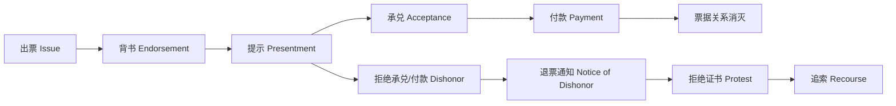

### 3.8.1 出票 Issue

出票是出票人签发汇票并将其交付给他人的行为。

要点：

- 出票人制作汇票并签字；
- 签字使汇票生效；
- 出票人将汇票交付给收款人或他人；
- 出票以创设票据权利义务为目的。

### 3.8.2 背书 Endorsement

背书是在汇票背面或粘单上签字并交付给被背书人的行为。

有效背书条件：

- 制作在汇票背面或粘单上；
- 转让全部金额；
- 背书连续。

背书类型：

| 类型 | 英文 | 含义 |
|---|---|---|
| 特别背书 / 完全/记名背书 | Special Endorsement | 有背书人签字并写明被背书人 |
| 空白背书 / 无记名背书 | Blank Endorsement | 只有背书人签字，不注明被背书人，或转让给来人 |
| 限制性背书 | Restrictive Endorsement | 限制被背书人再转让，只能凭票取款 |
| 附条件背书 | Conditional Endorsement | 背书带条件；条件只约束背书人与被背书人 |
| 托收背书 | Endorsement for Collection | 被背书人只获得代理收款权，不发生权利转让 |
| 设质背书 | Endorsement in Pledge | 在票据权利上设定质权 |
| 回头背书 | Reversed Endorsement | 以票据债务人为被背书人，权利可能受限制 |

### 3.8.3 提示 Presentment

提示是持票人向付款人出示汇票，要求承兑或付款的法律行为。

| 类型 | 含义 | 期限重点 |
|---|---|---|
| 提示承兑 | 向付款人要求承兑 | 远期汇票通常出票日起 1 个月内 |
| 提示付款 | 向付款人要求付款 | 即期汇票通常 1 个月内；远期汇票到期日起 10 天内提示付款 |

### 3.8.4 承兑 Acceptance

承兑是远期汇票的付款人在汇票正面签章，表示同意按出票人命令到期付款，并将汇票交还持票人的票据行为。

承兑要项：

- “Accepted”字样；
- 承兑日期；
- 承兑人名称；
- 承兑人签字或签章。

承兑类型：

| 类型 | 英文 | 含义 |
|---|---|---|
| 普通承兑 | General Acceptance | 完全按照汇票内容承兑 |
| 限制性承兑 | Qualified Acceptance | 对承兑内容作限制 |
| 有条件承兑 | Conditional Acceptance | 承兑附条件 |
| 部分承兑 | Partial Acceptance | 只承兑部分金额 |
| 限制地点承兑 | Local Acceptance | 限定付款地点 |
| 延长付款时间承兑 | Qualified Acceptance as to Time | 延长付款时间 |

### 3.8.5 付款 Payment

付款是付款人支付票据金额，使票据债权债务关系消灭的行为。

正当付款条件：

1. 在汇票到期日或以后付款；
2. 由付款人或承兑人支付；
3. 向持票人支付；
4. 善意支付。

我国《票据法》，执行付款人必须于提示付款当日内足额付款。

### 3.8.6 退票、退票通知、拒绝证书

| 概念 | 英文 | 含义 |
|---|---|---|
| 退票 / 拒付 | Dishonor | 拒绝承兑或拒绝付款 |
| 退票通知 | Notice of Dishonor | 票据遭拒付时，持票人或背书人通知前手和出票人 |
| 拒绝证书 | Protest | 公证机关或有权机构出具的证明退票事实的法律文件 |

### 3.8.7 追索 Recourse

追索是汇票不获承兑、不获付款或出现其他法定原因时，持票人在履行保全手续后，向前手背书人、出票人要求清偿票据金额和费用的行为。

期限重点：

| 权利 | 期限 |
|---|---|
| 持票人对出票人和承兑人的权利 | 即期汇票自出票日起 2 年；远期汇票自付款到期日起 2 年 |
| 持票人对前手的追索权 | 自被拒付日起 6 个月 |
| 再追索权 | 自清偿日或被起诉日起 3 个月 |

### 3.8.8
参加承兑（Acceptance for Honor）

在汇票未获承兑或者未获付款后，非汇票债务人在征得持票人同意的情况下，参加承兑已遭拒绝承兑的汇票的一种附属票据行为。

参加付款（Payment for Honor）

在因拒绝付款而退票，并已作成拒绝付款证书的情况下，非票据债务人可以参加支付汇票票款。

保证（Guarantee）

汇票的保证是指票据债务人以外的第三者，为担保特定票据债务人履行债务而自愿承担同一内容的票据债务的票据行为。

既有从属性又与独立性

## 💰 3.9 汇票在融资中的运用

### 3.9.1 贴现 Discount

贴现是持票人在票据到期前，为获取现款，向银行贴付一定利息所作的票据转让。

公式：

```text
贴现净值 = 到期价值 - 贴现利息
贴现息 = 票面金额 × 贴现率 × 贴现天数 / 360 或 365
```

注：美元一般按 360 天，英镑一般按 365 天。

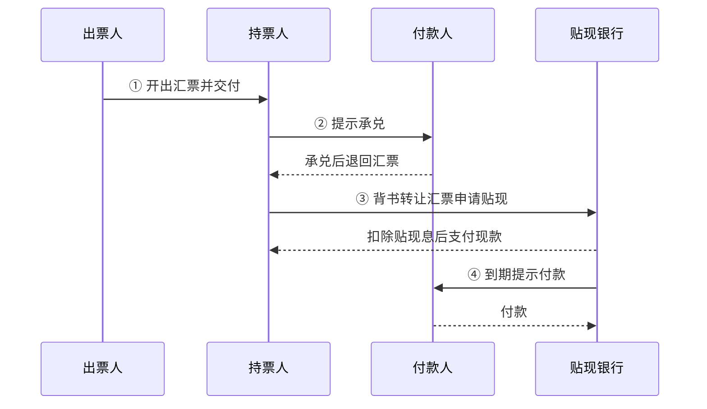

影响汇票身价与贴现率的因素：

- 出票人和承兑人的信用地位；
- 汇票起源交易是否可靠；
- 是否注明根据信用证出具，如 `drawn under ...`；
- 承兑费、印花税、贴现率等费用。

### 3.9.2 汇票融通 Accommodation

汇票融通是指一人为了帮助另一人获得资金融通，在没有从后者收取对价的情况下，以出票人、承兑人或背书人身份在汇票上签字，使对方能够以持票人身份转让票据筹集资金。

| 当事人 | 含义 |
|---|---|
| 融通人 Accommodation Party | 签字提供信用帮助的人 |
| 被融通人 Accommodated Party | 接受帮助的持票人 / 筹资者 |

中国票据法要求票据签发和取得具有真实交易关系和债权债务关系，原则上禁止无真实交易基础的融通票据。

例：A公司欲融通资金，得到了经营融通票据业务的B银行的承兑信用额度的承诺后，A公司作为该汇票的出票人，同时又是收款人，B银行在汇票上承兑，成为该汇票的主债务人。利用B银行的信誉，A公司得以在金融市场上将汇票贴现，获得所需资金，其金额为汇票的面值扣减至到期日的贴现息。然后，在汇票到期日之前，A公司将足额票款交付B银行。受让汇票的贴现银行于汇票到期日向承兑人B银行提示，B银行即偿付票款。

本例中B银行为融通人，A公司为被融通人（即筹资者），所开立的汇票为无对价关系的融通票据。B银行向A公司授信而无需提供资金，但可收取承兑手续费；A公司利用B银行的信用筹措到所需资金，付出的代价是贴现息和承兑费用；而贴现银行所获得的利益是贴现息。

## 🗂️ 3.10 汇票分类

| 分类标准 | 类型 |
|---|---|
| 按付款时间 | 即期汇票 Sight Bill：见票即付或没有规定付款期限；远期汇票 Time Bill：将来支付；承兑 |
| 按出票人身份 | 银行汇票 Banker’s Draft：出票人和付款人都是银行，风险小；商业汇票 Trader’s Draft：非银行签发的汇票，其付款人可以是银行也可以是非银行 |
| 按承兑人身份 | 银行承兑汇票 Banker’s Acceptance Bill：信用等级高；商业承兑汇票 Trader’s Acceptance Bill |
| 按使用货币 | 本币汇票 Local Currency Bill；外币汇票 Foreign Currency Bill |
| 按流通地域 | 国内汇票 Domestic Bill：出票地与付款地处于同一国家；国际汇票 / 外国汇票 International / Foreign Bill：出票地与付款地分处两国 |
| 按当事人重复性 | 普通汇票；变式汇票 |
| 按附属单据 | 光票 Clean Bill；跟单汇票 Documentary Bill |
| 特殊类型 | 中心汇票：付款人为该货币清算中心银行的即期银行汇票 |

变式汇票：基本当事人重复
1.已付汇票（对己汇票）：出票人同时为付款人；在中国，银行汇票均为对己汇票
2.已受汇票（指己汇票）：出票人同时为收款人；国际贸易中通常使用：出口商发货后签发
3.付受汇票：付款人同时为收款人；对付款人的内部结算比较便利
4.已付已受汇票：出票人、付款人和收款人同为一人；一般用于同一银行的各分行之间签发

光票（Clean Bill）：不附有货运单据、银行汇票多为光票、付款完全凭当事人的信用、在国际贸易中用于支付佣金、代垫费用、收取尾款

跟单汇票（Documentary Bill）：又称押汇汇票或信用汇票、附有货运单据，通常是商业汇票、是国际贸易结算的主要工具

中心汇票例子：如以纽约某银行为美元汇票付款人的汇票，以东京某银行为日元汇票付款人的汇票，以伦敦某银行为英镑汇票付款人的汇票等都是中心汇票。

---

<a id="ch4"></a>

# 🏦 4. 第四章：本票与支票

## 📄 4.1 本票 Promissory Note

我国《票据法》：本票是出票人签发的、承诺自己在见票时无条件支付确定金额给收款人或者持票人的票据。我国票据法所称本票，是指**银行本票**。

**一句话记忆：本票 = 出票人自己承诺付款。**

### 4.1.1 本票必要项目

1. 写明“本票”字样；
2. 无条件支付承诺；
3. 一定金额；
4. 付款期限；
5. 收款人名称；
6. 出票日期和地点；
7. 付款地点；
8. 制票人签字。

### 4.1.2 本票与汇票区别

| 比较项 | 本票 | 汇票 |
|---|---|---|
| 基本性质 | 无条件承诺，已付证券 | 无条件命令或委托，委付证券 |
| 基本当事人 | 制票人、收款人 | 出票人、付款人、收款人 |
| 签发票据人的责任 | 制票人为主债务人 | 出票人通常承担连带责任，承兑后承兑人为主债务人 |
| 份数 | 一式一份 | 可以成套签发 |
| 远期票据程序 | 没有承兑 | 远期汇票需要提示承兑 |
| 退票处理 | 国际本票退票不需拒绝证书 | 国际汇票退票通常需拒绝证书 |

### 4.1.3 本票用途

- 商品交易中的远期付款；
- 金钱借贷凭证；
- 企业向外筹资；
- 银行以即期本票代替现金支付。

### 4.1.4 本票常用形式

| 形式 | 含义 |
|---|---|
| 商业本票 Trader’s Notes | 工商企业为制票人签发的本票 |
| 银行本票 Banker’s Notes | 银行为出票人签发，常用于代替现金支付或转移资金 |
| 国际小额本票 International Money Order | 由货币清算中心银行作为签票行发行 |
| 旅行支票 Traveller’s Cheque | 兼有本票和支票性质 |
| 流通存单 Certificate of Deposit, CD | 大额、固定金额、固定期限存款单证 |

### 4.1.5 中国本票规定

- 本票必须记载收款人名称，否则无效；
- 中国不存在无记名本票，只有记名本票；
- 中国只有银行能签发本票，企业不能签发本票；
- 中国本票均为见票即付，不承认远期本票效力；
- 因此中国本票功能主要是支付工具，信用功能下降。

## 🧾 4.2 支票 Cheque / Check

我国《票据法》：支票是出票人签发的，委托办理支票存款业务的银行或者其他金融机构在见票时无条件支付确定金额给收款人或者持票人的票据。

**一句话记忆：支票 = 银行客户命令开户银行见票即付。**

### 4.2.1 支票必要项目

1. 写明“支票”字样；
2. 无条件支付命令；
3. 付款银行名称和地点；
4. 出票日期与地点；
5. 一定金额；
6. 收款人；
7. “即期”字样，如未写明仍视为见票即付；
8. 出票人签字。

### 4.2.2 支票特点

- 出票人必须是银行存款户；
- 出票人必须在银行有足够存款；
- 出票人与银行签有使用支票协议；
- 支票为见票即付，不需要承兑；
- 主要是支付工具，不具备明显信用功能；
- 付款人仅限银行或其他金融机构；
- 通常出票人为主债务人；
- 提示付款有合理期限。

### 4.2.3 支票种类

| 分类标准 | 类型 | 含义 |
|---|---|---|
| 按抬头 | 记名支票 | 抬头注明收款人名称 |
| 按抬头 | 无记名支票 / 来人支票 | 空白或来人支票；中国法允许未记载收款人，经授权可补记 |
| 变式支票 | 对己支票 | 出票人和付款人为同一当事人，只能银行等金融机构签发 |
| 变式支票 | 指己支票 | 出票人和收款人为同一当事人 |
| 变式支票 | 受付支票 | 付款人为收款人，收款人也只能是金融机构 |
| 按支付方式 | 现金支票 | 只用于支取现金 |
| 按支付方式 | 转账支票 | 只用于转账 |
| 按保障 | 普通支票 | 无“现金”或“转账”等特殊限制 |
| 按保障 | 划线支票 Crossed Cheque | 收款人只能委托银行收款，不能直接取现 |
| 按保障 | 保付支票 Certified Cheque | 银行记载“照付/保付”等并签名后承担付款责任；中国票据法未规定 |

### 4.2.4 划线支票

| 类型 | 含义 |
|---|---|
| 普通划线支票 | 不注明收款银行，收款人可通过任何银行收款 |
| 特殊划线支票 | 平行线中注明收款银行，只能通过指定银行收款 |
| Not Negotiable | 出票人仅对收款人负责，转让后对后手不负责 |
| Account Payee | 收款银行只能将票款记入收款人账户，不得直接付现 |

出票人、背书人或者持票人均可以在支票上记载平行线，其效力相同。
平行线要记载于支票的正面，记载于支票背面无效。实务中，通常记载于支票正面的左上角。


### 4.2.5 支票止付与退票

支票止付 Countermand：在支票解付以前撤销付款。我国票据法没有专门规定支票止付，但票据遗失时，失票人可通知付款人挂失止付，并通过法律程序保全权利。

支票退票原因：

- 空头支票；
- 超过合理提示期限；
- 背书欠缺或不连续；
- 出票人签章不符合预留式样；
- 破损支票；
- 大小写金额不符；
- 必要记载不符合规定。

### 4.2.6 空头支票后果

签发空头支票或签发与预留签章不符的支票，不以骗取财物为目的的，由中国人民银行对出票人处以票面金额 5% 但不低于 1000 元罚款；持票人有权要求出票人赔偿支票金额 2% 的赔偿金。

### 4.2.7 支票与汇票区别

| 项目 | 支票 | 汇票 |
|---|---|---|
| 出票人/付款人 | 出票人是银行客户，付款人为开户银行 | 出票人、付款人可以是不受限定的任何人 |
| 性质 | 授权书，支付工具 | 委托书，支付和信用工具 |
| 付款期限 | 只有即期付款，无承兑，无到期日记载 | 有即期和远期，可记载到期日 |
| 主债务人 | 通常是出票人 | 出票人或承兑人 |
| 保证付款 | 可以保付 | 无保付，但可有第三者保证 |
| 撤销 | 可以止付 | 承兑后不可撤销 |
| 份数 | 只能开一张 | 可以开一套 |
| 特殊行为 | 无参加承兑、参加付款 | 汇票有时有参加承兑、参加付款 |

---

<a id="ch5"></a>

# 💸 5. 第五章：汇款与托收

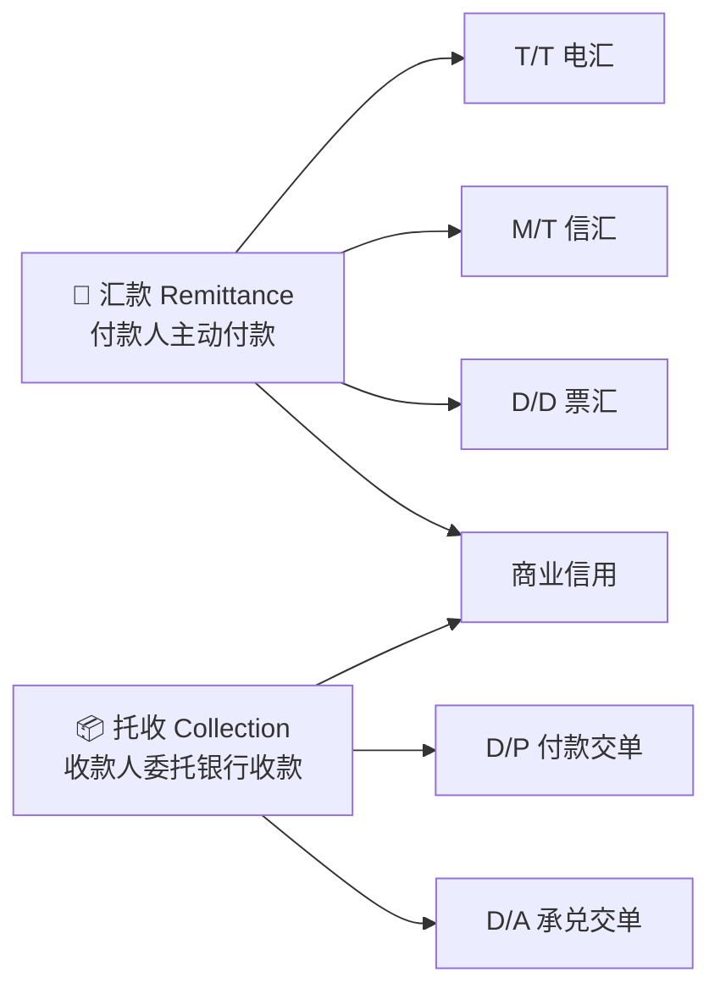

> [!WARNING]
> 汇款和托收都主要建立在**商业信用**基础上，银行通常只是办理或代收，不等于替进口商保证付款。

## 💌 5.1 汇款 Remittance

汇款又称汇付，是银行应付款人要求，以一定方式将款项通过国外联行或代理行交付收款人的结算方式。

### 5.1.1 汇款基本当事人


| 当事人 | 英文 | 作用 |
|---|---|---|
| 汇款人 | Remitter | 提交汇款申请书，付款方 |
| 汇出行 | Remitting Bank | 接受汇款申请，发出付款指示 |
| 汇入行 / 解付行 | Paying Bank | 按指示向收款人解付款项 |
| 收款人 | Payee | 最终收款人 |

### 5.1.2 汇款种类

| 方式 | 英文 | 工具 | 优点 | 缺点 |
|---|---|---|---|---|
| 电汇 T/T | Telegraphic Transfer | 电报、电传、SWIFT，加押密押证实 | 速度最快，安全性高 | 费用较高 |
| 信汇 M/T | Mail Transfer | 信汇委托书或支付委托书 | 费用较低 | 速度慢，安全性低于电汇 |
| 票汇 D/D | Demand Draft | 银行即期汇票 | 灵活，费用较低 | 汇票可能丢失、毁损；流程与前两者不同 |

### 5.1.3 电汇 / 信汇流程

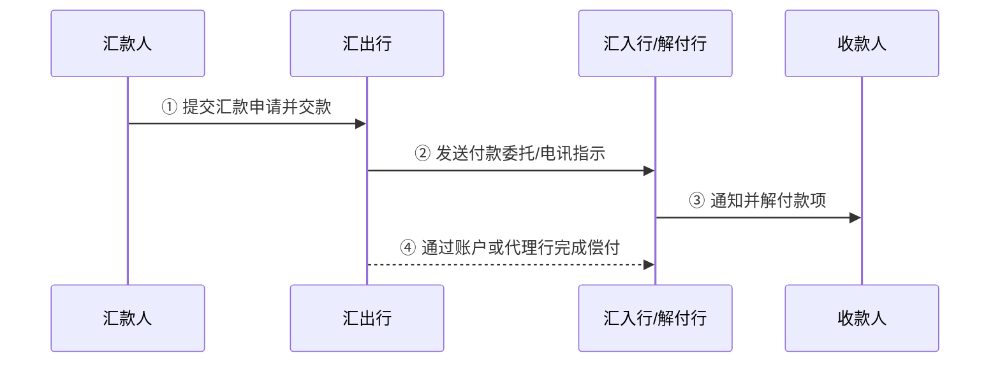

### 5.1.4 票汇 D/D 流程

票汇与电汇、信汇的关键区别：**汇出行不是直接通知汇入行付款，而是开出以汇入行为付款人的银行即期汇票交给汇款人。**

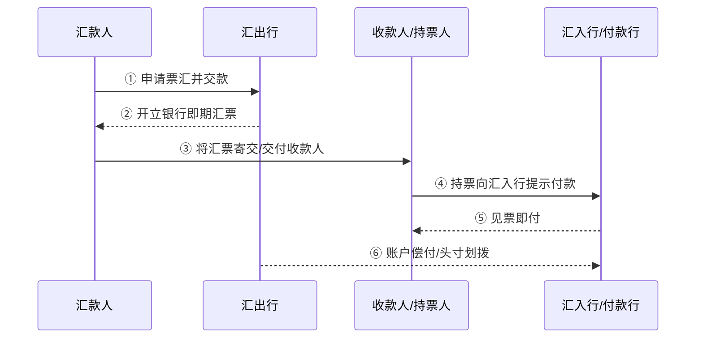

### 5.1.5 汇款偿付 Cover Instruction

| 情况 | 偿付指示表达 |
|---|---|
| 汇入行在汇出行开有账户 | `In cover, we have credited the sum to your account with us.` |
| 汇出行在汇入行开有账户 | `In cover, please debit our account with you.` |
| 双方在第三方银行均有账户 | `We have authorized Y Bank to debit our account and credit your account with them.` |
| 无直接账户、无共同账户行 | `We have instructed XX Bank to remit proceeds to you.` |

### 5.1.6 汇款退汇

| 方式 | 可退汇情况 |
|---|---|
| 电汇 / 信汇 | 汇款人要求退汇；收款人拒收或通知不到收款人 |
| 票汇 | 汇票未寄出时汇款人可退汇；收款人可将汇票退回汇款人 |
| 票汇已流通 | 不论汇出行还是汇入行，一般都不能办理退汇 |

### 5.1.7 汇款在国际贸易中的应用

- 预付货款 Payment in Advance；
- 货到付款 Payment after Arrival of the Goods；
- 赊账交易 Open Account Transaction；
- 延期付款 Deferred Payment；
- 售定 Goods Sold；
- 寄售 Consignment：出口商出运时尚无明确买家，委托国外经销商代理销售，对卖方而言是较差收款条件。

### 5.1.8 汇款特点

- 结算基础是商业信用；
- 银行只是受托办理，不承担货物买卖和货款收付风险；
- 汇出行对邮递过程延误、遗失及邮电部门过失不承担责任；
- 风险和资金负担不平衡；
- 缺乏相关融资手段；
- 手续简单、费用低。

## 📦 5.2 托收 Collection

托收是收款人或债权人为取得因劳务、商品及其他交易引起的应收款项，将有关单据交给本地银行，委托银行通过国外代理行向付款人或债务人交单取款的业务。

| 类型 | 含义 |
|---|---|
| 光票托收 | 金融单据托收，一般用于尾款、代垫费用、佣金、样品费等 |
| 跟单托收 | 伴随商业单据的托收，是国际贸易中更常见的形式 |

### 5.2.1 托收基本当事人

| 当事人 | 英文 | 责任 |
|---|---|---|
| 委托人 | Principal | 通常为出口商；承担贸易合同责任和委托代理合同责任 |
| 托收行 | Remitting Bank | 审查申请书和单据，缮制托收委托书，按常规处理并承担过失责任 |
| 代收行 | Collecting Bank | 审查委托书和单据，保管单据，反馈托收情况，谨慎处理货物 |
| 提示行 | Presenting Bank | 向付款人提示，接受付款或承兑并交单；实务中常由代收行兼任 |
| 付款人 | Drawee | 通常为进口商；履行贸易合同付款义务，不得无故延迟或拒付 |

## 🔐 5.3 跟单托收交单条件

### 5.3.1 D/P 付款交单 Documents against Payment

付款交单是指代收行以进口商付款为条件向进口商交单。

#### D/P 即期流程

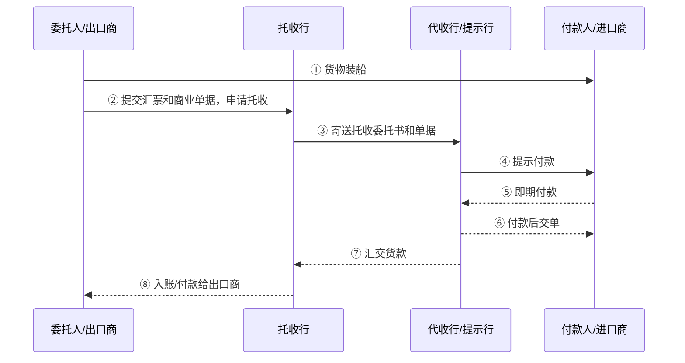

#### D/P 远期流程

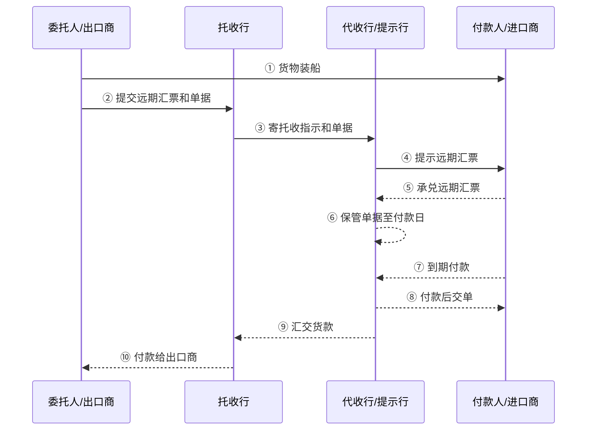

重点：D/P 远期虽然有远期汇票和承兑环节，但**单据原则上仍应在付款后才交给进口商**。

### 5.3.2 D/A 承兑交单 Documents against Acceptance

承兑交单是指代收行在进口商承兑远期汇票后，即向进口商交单。

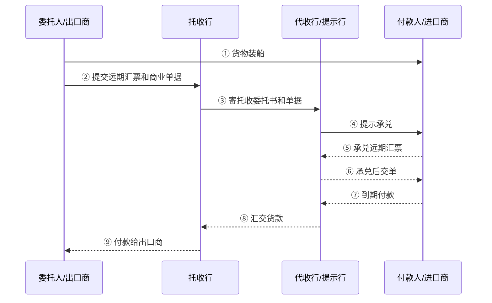

> [!TIP]
> 判断 D/P 和 D/A 的关键不是“有没有远期汇票”，而是：**进口商拿到单据之前，是否已经付款？**  
> - 已付款才交单：D/P  
> - 只承兑就交单：D/A

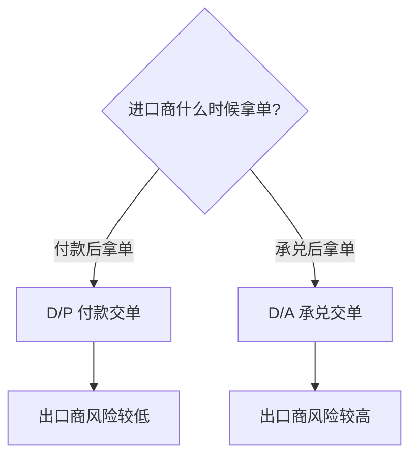

### 5.3.3 三种交单条件比较

| 条件 | 汇票 | 出口商风险 | 进口商资金使用效率 | 核心区别 |
|---|---|---|---|---|
| D/P 即期 | 无汇票或即期汇票 | 低 | 较高 | 付款后立即交单 |
| D/P 远期 | 远期汇票 | 低于 D/A，但有操作风险 | 较低 | 承兑后不应交单，到期付款后交单 |
| D/A | 远期汇票 | 高 | 较高 | 承兑后即可取得单据，出口商等到期收款 |

## 🧾 5.4 其他交单条件

| 条件 | 英文 | 风险点 |
|---|---|---|
| 分批部分付款 | Partial Payment | 一部分即期付款，余额承兑远期汇票；适用于分批装运 |
| 凭本票交单 | Delivery against Promissory Note | 最好要求银行本票，商业本票风险较高 |
| 凭付款承诺书交单 | Delivery against Letter of Undertaking to Pay | 属于商业信用，不是金融票据，风险较大 |
| 凭信托收据交单 | Delivery against Trust Receipt, T/R | 常是代收行为进口商提供融资，若不当交单风险可能由银行承担 |
| 凭保函交单 | Delivery against Letter of Guarantee | 银行保函风险小于普通付款承诺书 |

## 👥 5.5 托收汇票当事人及背书

托收汇票中：

- 出票人：出口商 / 卖方；
- 付款人：进口商 / 买方；
- 收款人：可以是出口商、托收行或代收行。

### 情况 1：出口商为收款人

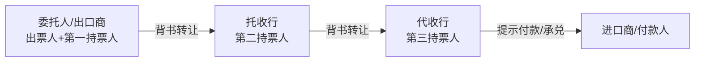

### 情况 2：托收行为收款人


### 情况 3：代收行为收款人

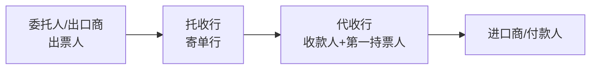

## 🏦 5.6 跟单托收中的资金融通

### 银行对出口商的融资

| 方式 | 含义 |
|---|---|
| 出口押汇 Outward Bills | 出口商将代表物权的提单及其他单据抵押给银行，取得扣除利息和费用后的有追索权垫款 |
| 出口商承兑信用额度 Line of Acceptance Credit for Exporter | 利用融资汇票进行资金融通；出口商为出票人，托收行为付款人 |

### 银行对进口商的融资

- 凭信托收据借单提货；
- 为进口商承兑信用额度；
- 凭银行担保提货。

## ⚠️ 5.7 托收特点与风险

### 托收特点

- 比汇款更安全；
- 结算基础仍是商业信用；
- 资金负担仍不平衡；
- 比汇款手续稍多、费用稍高。

### 出口商风险

托收方式下，出口商发货后主动权掌握在进口商手中，能否收款主要取决于进口商资信。因此出口商风险大于进口商。

防范：

- 认真调查进口商资信；
- 尽量选择 D/P 即期；
- 谨慎使用 D/A 和 D/P 远期；
- 托收指示书写清楚按 URC522 办理；
- 明确交单条件、付款期限、是否允许信托收据放单；
- 关注目的地国家习惯做法。

### 进口商风险

进口商可能付款提货后发现货物与样品或要求不符，甚至是假货，退货困难。

防范：

- 要求检验证书；
- 选择可靠出口商；
- 合同中约定质量、检验、索赔条款；
- 必要时采用信用证或第三方检验。

---

<a id="ch6"></a>

# 🏦 6. 第六章：信用证 Letter of Credit


> [!IMPORTANT]
> 信用证这一章的主线不是“银行帮买卖双方付款”这么简单，而是要抓住三个核心：
>
> 1. **银行信用**：开证行承担第一性付款责任；  
> 2. **独立性原则**：信用证独立于基础买卖合同；  
> 3. **单据交易原则**：银行处理的是单据，不是货物本身。  

---

## 🧭 6.0 本章复习路线

| 模块 | 你要掌握什么 | 高频关键词 |
|---|---|---|
| 信用证概述 | 信用证定义、特点、UCP600、独立性原则 | 银行信用、第一性付款责任、单证一致 |
| 当事人 | 申请人、开证行、受益人、通知行、议付行、保兑行等 | Applicant、Issuing Bank、Beneficiary |
| 信用证内容 | L/C 本身、货物、运输、单据、其他条款 | Expiry Date、Amount、Availability |
| 业务程序 | 从申请开证到付款赎单的全流程 | 开证、通知、装运、交单、审单、偿付 |
| 信用证种类 | 按单据、保兑、付款方式、转让、融资功能分类 | Confirmed、Transferable、Back-to-back |
| 风险防范 | 软条款、假信用证、单据不符、买卖双方风险 | Soft Clause、Discrepancy、Fraud |

---

# 📌 6.1 信用证概述

## 6.1.1 信用证的定义

信用证是：

> **有条件的银行付款承诺。**

更完整地说：

> 信用证是银行（开证行）根据申请人的要求和指示，向受益人开立的，在一定期限内凭规定的、符合信用证条款的单据，即期或在一个可以确定的将来日期承付一定金额的书面承诺。

```mermaid
flowchart LR
  A[进口商/申请人 Applicant] -->|申请开证| B[开证行 Issuing Bank]
  B -->|开立信用证| C[出口商/受益人 Beneficiary]
  C -->|提交符合信用证条款的单据| B
  B -->|承付/付款| C
```

> [!NOTE]
> 信用证不是“看到货物就付款”，而是**看到符合规定的单据才付款**。  
> 所以信用证业务的核心判断是：**单证一致、单单一致**。

---

## 6.1.2 UCP600 与不可撤销信用证

自 **UCP600** 起，所有跟单信用证均为**不可撤销信用证**。这体现了信用证保护受益人利益的原则。

UCP600 第 7 条第 2 款的核心意思是：

> 开证银行自开立信用证时起，即不可撤销地受承付约束。

信用证不可撤销性具有两个特性：

| 特性 | 英文 | 含义 |
|---|---|---|
| 不可撤销性 | Irrevocability | 信用证开立后，开证行不能单方面撤销或修改 |
| 确定承诺 | Definite Undertaking | 只要受益人交单相符，银行承担确定的承付义务 |

---

## 6.1.3 信用证的三大特点

| 特点 | 英文表达 | 通俗理解 |
|---|---|---|
| 开证行负第一性付款责任 | The issuing bank assumes a primary liability | 开证行不是“帮忙转账”，而是自己承担付款责任 |
| 信用证是自足文件，具有独立性 | Credits are independent of contracts | 信用证和买卖合同相互独立 |
| 银行处理的是单据，不是货物 | Banks deal with documents instead of goods | 银行只审单，不验货 |

### 🏦 1）开证行承担第一性付款责任

信用证体现的是**银行信用**。只要受益人提交的单据符合信用证要求，开证行就应承付。

### 📄 2）信用证具有独立性

信用证是自足文件，独立于销售合同。

```mermaid
flowchart TB
  A[买卖合同问题\n如货物质量不符] -.不当然影响.-> B[信用证付款承诺]
  B --> C[银行只根据信用证审核单据]
```

> [!WARNING]
> 买方不能因为“货物质量不符合合同”就当然要求银行拒付。  
> 银行审查的是单据是否符合信用证，而不是货物是否真的符合合同。

### 🧾 3）信用证业务处理对象是单据

银行处理的是：

- 商业发票；
- 提单；
- 保险单；
- 检验证书；
- 产地证；
- 装箱单；
- 其他信用证要求的单据。

银行不负责检查货物实物本身。

---

## 6.1.4 三角契约安排 Triangular Contractual Arrangement

信用证业务中存在三类相互独立的契约关系：

```mermaid
flowchart TB
  A[进口商/开证申请人] <-->|① 销售合同| B[出口商/受益人]
  A <-->|② 开证申请书\n担保协议/偿付协议| C[开证行]
  C <-->|③ 跟单信用证| B
  D[保兑行] <-->|若加保兑\n保兑承诺| B
```

| 契约 | 当事人 | 内容 |
|---|---|---|
| 第一层 | 进出口商 | 销售合同 |
| 第二层 | 开证申请人与开证行 | 开证申请书、担保协议或偿付协议 |
| 第三层 | 开证行与受益人 | 跟单信用证 |
| 保兑情形 | 保兑行与受益人 | 额外的确定付款承诺 |

> [!IMPORTANT]
> 每一项契约都是独立的。  
> 申请人因与开证行之间、或与受益人之间的关系产生的索偿或抗辩，不能影响银行对受益人的付款承诺。

---

## 6.1.5 《跟单信用证统一惯例》UCP600

**UCP** 全称：

> Uniform Customs and Practice for Documentary Credit

中文为：

> 《跟单信用证统一惯例》

它是国际商会制定并出版的关于跟单信用证的国际使用规则，是国际贸易和国际结算中非常重要的惯例。

| 项目 | 内容 |
|---|---|
| 制定机构 | 国际商会 ICC |
| 适用对象 | 跟单信用证 |
| 新版实施时间 | 2007 年 7 月 1 日起实施 UCP600 |
| 常见条款表达 | `This credit is subject to Uniform Customs and Practice for Documentary Credits, ICC Publication No. 600.` |

---

## 🧪 6.1.6 案例：第一批货物质量不符，第二批信用证项下银行能否拒付？

### 📍 案情

某笔进出口业务约定分两批装运，支付方式为即期不可撤销信用证。

第一批货物发送后，买方办理了付款赎单手续，但收到货物后发现货物品质与合同严重不符。于是买方要求开证行通知议付行：第二批信用证项下的货运单据不要议付。银行不予理睬。后来议付行仍对第二批信用证项下单据予以议付。议付后，付款行通知买方付款赎单，买方拒绝。

### ❓ 问题

1. 银行的处理方法是否合适？
2. 买方应如何处理？

### ✅ 分析

银行处理方法是合适的。

原因：

- 信用证是自足文件；
- 银行只根据信用证审核单据；
- 只要做到**单单一致、单证一致**，银行就承担第一性付款责任；
- 第一批货物的质量纠纷属于买卖合同争议，不当然影响第二批信用证项下相符单据的议付。

买方较合适的处理方式是：

> 先付款赎单，再与出口方联系，依据买卖合同追究货物品质与合同不符的责任。

---

# 👥 6.2 信用证的当事人及权利义务

```mermaid
flowchart LR
  A[Applicant\n开证申请人/进口商] -->|申请开证| B[Issuing Bank\n开证行]
  B -->|开立信用证| C[Advising Bank\n通知行]
  C -->|通知信用证| D[Beneficiary\n受益人/出口商]
  D -->|交单| E[Negotiating/Paying/Accepting Bank\n议付行/付款行/承兑行]
  E -->|寄单索偿| B
  B -->|偿付| E
  B -->|通知付款赎单| A
```

---

## 6.2.1 开证申请人 Applicant

开证申请人通常是贸易合同中的买方，即进口商。

### （一）贸易合同下买方的权利和义务

1. 根据贸易合同要求申请开证；
2. 在开证行破产或无力支付时，负有付款赎单责任；
3. 履行付款赎单义务后，有验货权、退货权或索赔权。

### （二）开证申请合同下申请方的权利和义务

1. 开证指示应明确、简洁、完整、一致；
2. 须承担开证费用，出具质押书，有时须支付开证押金；
3. 应及时履行赎单手续并按期付款；
4. 在赎单前有权审核单据；
5. 如果开证行未按开证申请书要求开证，又未经申请人事先确认，申请人有权拒绝赎单。

> [!TIP]
> 申请人不是信用证下直接向受益人付款的人。  
> 信用证项下对受益人承担第一性付款责任的是**开证行**。

---

## 6.2.2 开证行 Issuing Bank / Opening Bank

开证行是根据申请人申请开立信用证的银行，是信用证业务中最核心的银行。

### （一）开证申请合同下开证方的权利和义务

1. 须严格按照开证申请书的要求开证；
2. 必须按信用证规定严格审单和付款受单；
3. 因自身错误承担赔偿责任的范围，一般限于跟单汇票或发票面额加利息和必要费用；
4. 有权向开证申请人收取开证费用，要求申请人出具质押书，必要时要求预付押金；
5. 只管“单证一致”和“单单一致”，不管货物实际情况；
6. 当开证申请人无力付款赎单时，开证行有权处理单据和货物。

### （二）信用证项下出证方的权利和义务

1. 负有第一性的付款责任；
2. 对不可撤销信用证，开证行不能擅自撤销或修改；
3. 必须在收到单据的翌日起五个工作日内完成审单；
4. 如发现单证不符，可以拒付，也可在取得申请人认可后付款受单；
5. 如果拒付，须用尽可能快捷的方法通知代理行或受益人；
6. 付款后无追索权。

> [!NOTE]
> 如果得到授权的议付行或代付行在向开证行寄单的同时，已用电信索偿方式向偿付行得到拨付，而单据到达开证行后又发现不合格，开证行有权追回已付款项及利息。  
> 这仍属于**拒付**，而不是追索。

---

## 6.2.3 受益人 Beneficiary

受益人通常是贸易合同下的卖方，即出口商。

### （一）贸易合同下卖方的权利和义务

1. 应当做到**货约一致**和**单货一致**；
2. 当发现信用证条款与贸易合同条款不符时，可以接受该信用证，也可以要求修改；
3. 在开证行破产或无力支付时，可向进口商要求付款赎单。

### （二）信用证项下受益方的权利和义务

1. 须在信用证规定的装运期限内装运货物；
2. 须在信用证规定的效期内向信用证授权银行交单；
3. 须确保**单证一致**和**单单一致**。

---

## 6.2.4 通知行 Advising Bank

通知行是开证行在出口国的代理行，应根据与开证行之间的代理合同开展业务。信用证业务中，通知行与受益人通常并不存在直接法律关系。

通知行的主要职责：

1. **验明信用证真实性**：核对签字或密押无误后才通知受益人；
2. **及时澄清疑点**：属于道义责任，也是重要的非价格竞争手段；
3. **缮制通知书**：将信用证通知给受益人。

---

## 6.2.5 议付行 Negotiating Bank

议付行是经信用证授权，购买受益人提交的汇票或单据的银行。

主要权利与义务：

1. **有权不议付**：议付行通常只是受开证行邀请，并非自身作出付款承诺；
2. **必须严格审单**：确保单证一致，才能保全自身利益，及时收回垫款；
3. **享有索偿及追索权**：在未获准偿付前，对受益人享有追索权；
4. **有权要求受益人作质押**。

> [!WARNING]
> 议付行在没有得到偿付之前，如果开证行倒闭、无力偿付或拒付，议付行可能向受益人要求偿还付款。

---

## 6.2.6 保兑行 Confirming Bank

保兑行是在开证行授权或要求下，对信用证加具保兑的银行。

### （一）保兑行的权利

1. 有权决定是否对信用证保兑；
2. 有权决定对信用证修改部分是否加以保兑；
3. 付款后有权向开证行索偿；
4. 有权向开证行收取保兑费；
5. 有权审核单据。

### （二）保兑行的责任

1. **保兑行与开证行同责**：信用证加以保兑后，构成保兑行在开证行承诺以外的确定承诺，承担第一性付款责任；
2. **保兑不能片面撤销**。

---

## 6.2.7 付款行 Paying Bank

付款行一经接受开证行的代付委托，就有审核单据并付款的责任。

特点：

- 付款后无追索权，只能向开证行索偿；
- 有时付款行可根据开证行指示，不必验单，只凭议付行单证相符证明付款；
- 付款后对受益人也无追索权；
- 由于付款行本身未作付款承诺，如果开证行资信极差、付款后可能得不到偿付，付款行有权拒付。

---

## 6.2.8 偿付行 Reimbursing Bank

偿付行是信用证中指定的，对议付行或代付行进行偿付、清偿垫款的银行。

> 🧠 **通俗理解：**  
> 偿付行只是接受开证行委托，充当“出纳机构”，负责按指令向指定银行清偿款项。

---

## 6.2.9 当事人速记表

| 当事人 | 英文 | 位置 | 核心作用 |
|---|---|---|---|
| 开证申请人 | Applicant | 进口方 | 申请开证，最终付款赎单 |
| 开证行 | Issuing Bank / Opening Bank | 进口地银行 | 开证并承担第一性付款责任 |
| 受益人 | Beneficiary | 出口方 | 装运货物、制单交单、收款 |
| 通知行 | Advising Bank | 出口地银行 | 验真并通知信用证 |
| 议付行 | Negotiating Bank | 通常出口地银行 | 议付单据，有时垫款融资 |
| 保兑行 | Confirming Bank | 通常出口地银行 | 在开证行之外额外承诺付款 |
| 付款行 | Paying Bank | 指定银行 | 审单并付款 |
| 偿付行 | Reimbursing Bank | 指定清偿银行 | 按开证行指示偿付指定银行 |

---

# 📄 6.3 信用证的内容

信用证无论采用信开还是电开，其基本结构大致相同，主要包括：

```mermaid
mindmap
  root((信用证内容))
    信用证本身项目
      当事人
      开证日期地点
      有效期到期地点
      L/C编号
      金额币种
      支用方式
    商品描述
      品名规格
      数量单价
      价格条件
      包装唛头
    运输规定
      装货港
      卸货港
      转运
      分批装运
      最迟装运日
    单据要求
      提单
      发票
      保险单
      检验证书
      产地证
      装箱单
      装船通知
    其他条款
      银行费用
      汇票条款
      负责条款
      UCP适用
      签字密押
```

---

## 6.3.1 关于信用证本身的项目

### 1）当事人和关系人

基本当事人主要包括：

- 开证行；
- 申请人；
- 受益人。

关系人包括：

- 付款行；
- 议付行；
- 保兑行；
- 偿付行等。

### 2）开证日期、地点 Place and Date of Issue

UCP600 第 7 条规定，开证行自开立信用证时起，即不可撤销地受承付责任约束。该规定明确了开证行责任的开始时间。

### 3）有效期及到期地点 Expiry Date and Place

示例：

```text
2012.09.30 at New York
2011.11.20 in China
```

到期地点通常有三种规定方式：

1. 受益人所在地；
2. 开证行柜面；
3. 指定银行。

### 4）信用证编号 L/C No.

信用证编号用于识别信用证，后续汇票、单据和往来电文中常需注明。

### 5）信用证金额与币种 Amount

根据 UCP600，当金额前写有：

```text
about or approximately
```

应解释为允许 **10% 的增减幅度**。

金额应：

- 同时用大小写表示；
- 使用 ISO 货币代号表示。

常见 ISO 货币代号：

| 货币 | 代码 |
|---|---|
| 美元 | USD |
| 欧元 | EUR |
| 英镑 | GBP |
| 日元 | JPY |
| 人民币 | CNY |
| 港元 | HKD |
| 澳大利亚元 | AUD |
| 加拿大元 | CAD |

### 6）支用方式 Availability

支用方式说明信用证如何兑现。

| 支用方式 | 英文 |
|---|---|
| 即期付款 | Sight Credit / Sight Payment |
| 延期付款 | Deferred Payment Credit |
| 承兑 | Acceptance Credit |
| 议付 | Negotiation Credit |

---

## 6.3.2 关于商品的描述

商品描述一般包括：

- 品名；
- 规格；
- 数量；
- 单价；
- 价格条件；
- 包装；
- 唛头 Shipping Marks；
- 号码。

### 示例 1：蜂王浆

英文原文：

```text
Evidencing shipment of 700 kgs. Net of Chinese royal jelly products by Lao Shan factory in refrigerated container at JP¥ 4510.00 per KG net CIF Kobe
```

中文意思：

> 装运净重 700 公斤崂山厂生产的中国蜂王浆，装入冷冻集装箱，价格为每千克 4510 日元 CIF 神户。

### 示例 2：洗衣粉

英文原文：

```text
500 cartons 'Panda' brand Detergent (1 lb. × 30 bags per carton) under Sales Confirmation No.-
```

中文意思：

> 某售货确认书项下 500 箱“熊猫”牌洗衣粉，每箱为 1 磅 × 30 袋。

> [!TIP]
> 如果合同中货物规格品种过于复杂，信用证可省去详细规格，只写明合同号码或售货确认书号码。

---

## 6.3.3 关于运输的规定

### 1）有关港口或地点名称

常见项目：

| 中文 | 英文 |
|---|---|
| 装货港 | Port of Loading |
| 卸货港 | Port of Discharge |
| 转运港 | Port of Transshipment |

示例：

```text
Shipment from Shanghai to Singapore
```

### 2）转运与分批装运

常见表达：

```text
Partial shipment and transshipment are allowed/not allowed.
Partial shipment and transshipment are permitted/not permitted.
Partial shipment and transshipment are prohibited.
```

中文理解：

- Partial shipment：分批装运；
- Transshipment：转运；
- allowed / permitted：允许；
- not allowed / not permitted / prohibited：不允许、禁止。

### 3）最迟装运日 Latest Date of Shipment

常见表达：

```text
Shipment must be no later than...
```

含义：

> 最迟装运日是装运完毕的截止日期，而不是开始装运的日期。通常以运输单据签发日作为装运日。

---

## 6.3.4 关于单据的要求

常见引导语：

```text
Accompanied by the following documents marked with numbers
```

意思是：随附下列编号单据。

---

### 1）提单 Bill of Lading

常见英文条款：

```text
Full set clean "on board", "freight prepaid" ocean bill of lading made out to order and blank endorsed marked "notify buyers"
```

中文意思：

> 全套清洁、货已装船、运费预付、凭指示抬头、空白背书的海运提单，并注明通知买方。

关键词：

| 表达 | 含义 |
|---|---|
| Full set | 全套 |
| Clean B/L | 清洁提单 |
| On board | 已装船 |
| Freight prepaid | 运费预付 |
| Made out to order | 凭指示抬头 |
| Blank endorsed | 空白背书 |
| Notify buyers | 通知买方 |

---

### 2）商业发票 Commercial Invoice / Invoice

常见表达：

```text
Invoice is __ copies.
Signed commercial invoice in __ copies.
```

中文意思：

- 发票一式 __ 份；
- 经签署的商业发票一式 __ 份。

---

### 3）保险单或保险凭证 Insurance Policy or Certificate

常见英文条款：

```text
Insurance policy or certificates in duplicate blank endorsed covering All Risks for full CIF invoice value plus 10% as per C.I.C. claims payable at __
```

中文意思：

> 保险单或保险凭证一式两份，空白背书，根据中国保险条款，按照发票金额加 10% 投保一切险，在 __ 赔付。

> [!NOTE]
> CIF 条件下，保险通常按发票金额加成投保，常见为发票金额的 110%。

---

### 4）检验检疫证书或检验报告 Inspection Certificate

检验证书是由国家检验检疫机构或公证行对出口商品检验后签发的证明文件，用于证明：

- 商品质量；
- 商品数量；
- 重量；
- 产地；
- 其他合同要求事项。

其作用：

- 判断卖方交货是否符合合同标准；
- 作为拒付、索赔或理赔的重要依据。

常见英文条款：

```text
Inspection certificate of (for) quality, quantity, weight or origin in __ copies issued by State General Administration of the People’s Republic of China for Quality Supervision and Inspection and Quarantine
```

中文意思：

> 由中国国家质量监督检验检疫总局签发的质量、数量、重量检验证书或产地证书一式 __ 份。

---

### 5）产地证书 Certificate of Origin

产地证主要用于确定货物应征收的税率。

常见表达：

```text
Certificate of origin in __ copies issued by CCPIT
```

中文意思：

> 由中国国际贸易促进委员会签发的原产地证明书一式 __ 份。

---

### 6）重量单或装箱单 Weight Memo / Packing List

常见表达：

```text
Weight memo or packing list in __ copies indicating gross and net weights of each package
```

中文意思：

> 重量单或装箱单一式 __ 份，注明每件货物的毛重和净重。

---

### 7）装船通知 Advice of Shipment

常见表达：

```text
A telex from sellers advising the buyers of the shipment date, the name and the quantity of goods, and the name of the carrying vessel
```

中文意思：

> 卖方将装运日期、商品名称和数量以及载货船只名称通知买方的电传。

---

## 6.3.5 其他条款

### 1）对中介银行的指示

中介银行是指由开证行委托或指定进行信用证有关业务的银行，包括：

- 通知行；
- 指定银行；
- 付款行；
- 承兑行；
- 议付行等。

### 2）银行费用条款 Banking Charges

常见表达：

```text
All banking charges other than the issuing bank are for beneficiary’s account.
```

中文意思：

> 开证行以外的所有银行费用由受益人承担。

### 3）汇票条款 Drafts

常见表达：

```text
Available for 100% of invoice value against your draft(s) drawn on us at sight.
```

中文意思：

> 凭贵公司开具以我行为付款人、按发票金额 100% 计算的即期汇票付款。

### 4）负责条款 Engagement Clause / Undertaking Clause

负责条款是开证行对受益人或汇票持有人保证付款的责任文句。

常见表达：

```text
We hereby engage with beneficiary and/or bona fide holders that drafts drawn and negotiated in conformity with the terms will be duly honored on presentation.
```

中文意思：

> 我行向受益人及/或善意持票人保证，凡按照规定条款开立和议付的汇票，向受票人提示时均可兑付。

### 5）UCP 适用条款

常见表达：

```text
This credit is subject to Uniform Customs and Practice for Documentary Credits International Chamber of Commerce Publication No. 600.
```

中文意思：

> 本信用证适用国际商会第 600 号出版物《跟单信用证统一惯例》。

### 6）开证行授权签字或电讯密押

信用证还应包含开证行授权签字或电讯密押，以便相关银行核验真实性。

---

## 6.3.6 信开本信用证中文式样

信开本信用证一般包括以下项目：

```text
正本
银行
地址
日期
致：
兹开立不可撤销信用证第__号
受益人：
开证人：
汇票金额不得超过：
金额大写：
按__%装运下列出口货物之发票金额计算：
自__运至__，价格为__
受益人签发__日期汇票，以我行为付款人，并附具下列注有“×”标记之单据：
- 签署发票一式两份
- 保险单或保险凭证按发票金额加__%保妥下列各险
  - 平安险 / 水渍险 / 一切险及战争险
  - 陆上运输险
- 全套清洁“已装运”海运提单，作成我行抬头
- 注明运费付讫，通知开证人
- 其他单据
  - 产地证明书
  - 重量单
  - 装箱单
```

续页常见内容：

```text
准许/禁止分批装运
准许/禁止转运
装运日期不得迟于__
本证有效期内不得撤销，其有效期在你地限至__为止
凡凭本证所发出之汇票必须载明本证编号及开立日期
其他条款：
根据本信用证并按其所列条款开具之汇票向我行提示并交出本证规定之单据者，
我行同意对其出票人、背书人及正当持票人履行承兑付款责任。
议付银行注意：
凭本证议付汇票及单据请直接寄至我行。
开证行名称：
通知行名称：
签字：
```

> [!NOTE]
> 课件中提到的“7”记号，是经“银行关系合理化”的国际会议提议，通知行收到后应迅速处理的记号。

---

## 6.3.7 英文信用证样式 CREDIT

### 基本开证信息

```text
CREDIT

From: Bank of ×× Shanghai, China
To: Bank of ×× London, UK
Date: Feb. 1, 200×

We open an Irrevocable Credit No.686 in favour of:
A & Company, Limited, London

for account of:
China ×× I/E Corporation

to the extent of:
USD 50000
(US dollar Fifty Thousand, 5% less is allowed).
```

### 支用方式与汇票

```text
This Credit is available by beneficiary’s drafts, drawn on us,
in duplicate, at sight, for 100% of the invoice value,
and accompanied by the following documents:
```

### 所需单据

```text
- Full set of clean "on Board", "Freight prepaid" Ocean Bill of Lading,
  made out to order and blank endorsed,
  marked: "Notify China National Foreign Trade Transportation Corporation,
  at the port of destination."

- Invoice in quintuplicate,
  Contract No. & Credit No.,
  20 metric tons (5% less is allowed) of 1000 kilos net each of chemicals,
  purity 90%-99%,
  USD 2.50 per kilo net CIF Shanghai including packing charges.

- Weight Memo indicating gross and net weight of each package in quadruplicate.

- Certificate of Quality in four copies issued by the manufactures.

- Insurance Policies or Certificate in duplicate covering Marine ICC(A)
  for full CIF invoice value plus 10%.

- Certificate of Origin: United Kingdom.

- Manufacture’s Certificate: A. & Company, Limited. UK.

- Packing List: Packed in seaworthy new steel drums.
```

### 运输、有效期和单据处理

```text
Shipment from UK port to Shanghai.
Partial Shipment is not allowed.
Transshipment is allowed, through B/L required.
Shipment to be made on or before March 15, 200×.

This Credit is valid in London on or before March 30, 200×,
for negotiation and all drafts drawn hereunder must be marked
"drawn under Bank of ×× Shanghai Credit No.686".

Amount of drafts negotiated under this credit must be endorsed
on the back hereof.
```

### 单据寄送与负责条款

```text
Disposal of Documents:
It is a condition of this credit that the documents should be forwarded
to us by two consecutive airmails,
the first mail consisting of all documents except one of each items,
of more than one, to be sent by second mail.

Special Conditions:
We hereby engage with the drawers, endorsers and bona fide holders
of bills drawn and presented in accordance with the terms of this credit
that the bills shall be duly honoured on presentation.

This Credit is subject to ICC Uniform Customs and Practice for Documentary Credits.
```

---

# 🛰️ 6.4 SWIFT 信用证

## 6.4.1 SWIFT 是什么？

SWIFT 是：

> 环球银行金融电讯协会。

它成立于 1973 年，专门从事各国之间非公开性国际金融电讯业务，包括：

- 开立信用证；
- 办理信用证项下汇票业务；
- 银行之间资金清算和金融信息传递等。

凡利用该系统设计的特殊格式，通过该系统开立或通知的信用证称为 **SWIFT 信用证**，也称为**环银电协信用证**。

---

## 6.4.2 SWIFT 的特点

| 特点 | 说明 |
|---|---|
| 需要会员资格 | 全球大量银行参加，我国多数专业银行也是其成员 |
| 费用较低 | 约为 TELEX 电传的 18%，CABLE 电报的 2.5% 左右 |
| 安全性较高 | 电脑自动完成编押、核押，安全性较强 |
| 格式标准化 | 电文格式标准化、格式化、规范化 |

---

## 6.4.3 SWIFT 电文数字分类

SWIFT 用 0-9 的数字区分电文业务性质。

| 数字 | 业务类型 |
|---|---|
| 0 | 系统电报 |
| 1 | 客户汇款与支票 Customer Payment & Cheques |
| 2 | 银行头寸调拨 Financial Institution Transfers |
| 3 | 外汇买卖、货币市场及衍生工具 Foreign Exchange, Money Markets & Derivatives |
| 4 | 托收业务 Collection & Cash Letters |
| 5 | 证券业务 Securities Markets |
| 6 | 贵金属和银团贷款 Precious Metals and Syndications |
| 7 | 跟单信用证和保函 Documentary Credits and Guarantees |
| 8 | 旅行支票 Travelers Cheques |
| 9 | 银行和客户账务 Cash Management & Customers Status |

> [!IMPORTANT]
> 信用证业务通常属于 **7 字头电文**，例如 MT700。

---

## 6.4.4 常见信用证 SWIFT 电文

| 电文 | 含义 |
|---|---|
| MT700 / MT701 | 开立信用证，701 是 700 不够使用时增添使用 |
| MT705 | 跟单信用证预先通知 |
| MT707 | 跟单信用证修改 |
| MT710 / MT711 | 通知由第三家银行或非银行开立的信用证 |
| MT720 / MT721 | 跟单信用证转让 |
| MT730 | 确认 |
| MT732 | 单据已被接受的通知 |
| MT734 | 拒付通知 |
| MT750 | 通知不符点 |
| MT740 | 偿付授权 |
| MT752 | 授权付款、承兑或议付 |
| MT742 | 索偿 |
| MT754 | 已付款、承兑或议付的通知 |
| MT747 | 修改偿付授权 |
| MT756 | 通知已偿付或付款 |

---

## 6.4.5 SWIFT 项目 Field 表示方式

SWIFT 电文由项目 Field 组成。

示例：

| Field | 含义 |
|---|---|
| `59 BENEFICIARY` | 受益人 |
| `51a APPLICANT` | 申请人 |
| `31D DATE AND PLACE OF EXPIRY` | 信用证有效期和到期地点 |

项目有：

- 必选项目 Mandatory Field；
- 可选项目 Optional Field。

> [!TIP]
> 可选项目并不一定每个信用证都有；必选项目则是电文必须具备的基本字段。

---

## 6.4.6 SWIFT 日期、数字与货币表示

### 日期表示

SWIFT 日期格式为：

```text
YYMMDD
```

示例：

| 普通日期 | SWIFT 表示 |
|---|---|
| 1999 年 5 月 12 日 | 990512 |
| 2000 年 3 月 15 日 | 000315 |
| 2001 年 12 月 9 日 | 011209 |

### 数字表示

SWIFT 电文中，数字不使用分格号，小数点用逗号 `,` 表示。

| 普通数字 | SWIFT 表示 |
|---|---|
| 5,152,286.36 | 5152286,36 |
| 4/5 | 0,8 |
| 5% | 5 PERCENT |

### 货币表示

| 货币 | SWIFT 代码 |
|---|---|
| 澳大利亚元 | AUD |
| 奥地利元 | ATS |
| 比利时法郎 | BEF |
| 加拿大元 | CAD |
| 人民币元 | CNY |
| 丹麦克朗 | DKK |
| 德国马克 | DEM |
| 荷兰盾 | NLG |
| 芬兰马克 | FIM |
| 法国法郎 | FRF |
| 港元 | HKD |
| 意大利里拉 | ITL |
| 日元 | JPY |
| 挪威克朗 | NOK |
| 英镑 | GBP |
| 瑞典克朗 | SEK |
| 美元 | USD |

---

# 🔁 6.5 信用证的业务程序

```mermaid
sequenceDiagram
  participant Buyer as 进口商/申请人
  participant IB as 开证行
  participant AB as 通知行
  participant Seller as 受益人/出口商
  participant NB as 指定银行/议付行/付款行
  participant RB as 偿付行

  Buyer->>IB: ① 申请开证并提交担保
  IB->>AB: ② 开立信用证
  AB->>Seller: ③ 通知信用证/必要时保兑
  Seller->>Seller: ④ 审证、备货、装运
  Seller->>NB: ⑤ 交单支款
  NB->>NB: ⑥ 审单、付款/承兑/议付
  NB->>IB: ⑦ 寄单索偿
  IB->>NB: ⑧ 审单并偿付/拒付
  IB->>Buyer: ⑨ 单到及付款通知
  Buyer->>IB: ⑩ 付款赎单
```

---

## 6.5.1 进口商申请开证

### （一）开证申请书 Application for Issuing Letter of Credit

开证申请书是：

- 开证申请人与开证行之间的法律文件；
- 开证行开立信用证的依据；
- 内容必须完整、明确。

### （二）开证担保书 Secured Agreement for Letter of Credit

开证担保书是进口商与开证行之间的法律契约，是开证申请人对开证行作出的保证。

---

## 6.5.2 开证行开立信用证

### （一）开证前审查

开证行在开证前通常进行：

1. 审查开证申请书与开证担保书；
2. 审查开证申请人的资信状况；
3. 查验进口开证所需有效证件，如进口付汇核销单、进口许可证或特定商品进口登记证明；
4. 落实开证保证金。

### （二）开立信用证

信用证开立方式主要有：

| 方式 | 英文 | 说明 |
|---|---|---|
| 信开 | Open by Airmail | 信函格式开证，邮寄方式传递，几乎不再使用 |
| 电开 | Open by Telecommunication | 通过 Telex 或 SWIFT 开证 |
| 全电 | Full Cable | 电文即为有效信用证文本 |
| 简电 | Brief Cable | 预先通知信用证，后续寄证实书 |

全电常见表达：

```text
This cable is the operative credit instrument and no mail confirmation will follow.
```

简电常见表达：

```text
Pre-advice Credit
Mail Confirmation to Follow
```

---

## 6.5.3 信用证的通知、保兑及修改

### 1）信用证通知

通知行职责：

- 通过通知行向受益人转交信用证；
- 必须准确鉴定信用证真伪；
- 大部分信用证规定，开证行所在国以外发生的银行费用，包括通知费，由受益人支付。

### 2）信用证保兑

只有开证行才有权指示另一银行对信用证加具保兑。

保兑行对受益人承担与开证行完全一样的付款责任，且无追索权。

### 3）信用证修改

每一项修改都须得到：

- 开证行；
- 受益人；
- 保兑行（如有）

一致同意，才能生效。

---

## 6.5.4 受益人装运与交单

### 四、受益人按信用证规定装运货物

受益人收到信用证后，应审核信用证，包括：

- 信用证条款是否与合同一致；
- 商品描述是否准确；
- 装运期、有效期是否可行；
- 单据要求是否能做到；
- 是否存在软条款或风险条款；
- 是否有矛盾、含糊或无法操作条款。

### 五、受益人交单支款

受益人应：

1. 备单；
2. 交单；
3. 掌握交单日期。

交单时间要求：

- 要在到期日或到期日之前交单；
- 要在信用证规定交单期内交单；
- 要在银行营业时间交单；
- 最迟装运日不能顺延。

---

## 6.5.5 指定银行付款、承兑或议付

根据付款方式不同，指定银行可能是：

| 银行 | 行为 | 对受益人追索权 |
|---|---|---|
| 保兑行或付款行 | 审单付款 | 无追索权 |
| 议付行 | 垫款议付 | 可向受益人追索 |
| 承兑行 | 承兑，到期付款 | 无追索权 |

---

## 6.5.6 索偿、偿付与赎单

### 七、指定银行向开证行或偿付行索偿

指定银行付款、承兑或议付后，向开证行或偿付行索偿。

### 八、开证行或偿付行提供偿付

开证行应立即审核单据，并在合理时间内作出付款或拒付决定。

> [!IMPORTANT]
> 审单期限：从收到单据的翌日起算 **五个工作日**。

### 九、开证行向开证申请人发出单到及付款通知

开证行通知进口商单据已到并要求付款。

### 十、开证申请人付款赎单

进口商向开证行付款，取得单据，凭单提货。

---

# 🧩 6.6 信用证的种类

```mermaid
mindmap
  root((信用证种类))
    按单据
      光票信用证
      跟单信用证
    按保兑
      保兑信用证
      不保兑信用证
    按付款方式
      即期付款信用证
      延期付款信用证
      承兑信用证
      议付信用证
    特殊信用证
      可转让信用证
      背对背信用证
      对开信用证
      预支信用证
      循环信用证
```

---

## 6.6.1 按汇票是否附有单据划分

### （一）光票信用证 Clean Credit

光票信用证是指受益人可以凭信用证开立收据或汇票，一次或多次向指定银行领取款项，而不必提交货运单据的信用证。

用途：

- 旅游；
- 使领馆经费；
- 个人消费等非贸易结算；
- 贸易中预先支取货款；
- 结算贸易从属费用。

### （二）跟单信用证 Documentary Credit

跟单信用证是指凭跟单汇票或仅凭规定单据付款的信用证。

> [!NOTE]
> 本章后面介绍的各类信用证，大多都是跟单信用证。

---

## 6.6.2 根据信用证是否保兑划分

### （一）保兑信用证 Confirmed Credit

保兑信用证是指根据开证行授权或要求，由另一家银行即保兑行对不可撤销信用证加具保兑。只要信用证规定单据在到期日或以前提交至保兑行，并与信用证条款相符，保兑行即付款、承兑或议付。

常见表达：

```text
This credit is confirmed by us.
We hereby added our confirmation.
```

通常选择出口国银行为保兑行。

### （二）不保兑信用证 Unconfirmed L/C

实务中使用最多的是无保兑的不可撤销信用证。因为保兑会增加进口商负担，并可能转嫁给出口商，增加出口商品竞争压力。

常见表达：

```text
This is merely an advice of credit issued by the above mentioned bank which conveys no engagement on the part of this bank.
```

含义：

> 通知行仅通知信用证，不承担付款承诺。

---

## 6.6.3 根据信用证付款方式划分

### （一）即期付款信用证 Sight Payment Credit

即期付款信用证又称即期信用证，是指指定付款行在收到受益人提交的符合信用证条款的跟单汇票或不带汇票的单据后，立即向受益人付款。

常见表达：

```text
This credit is available with advising bank by sight payment against the documents detailed herein.
```

情况：

- 开证行为付款行：直接付款信用证 Straight Credit；
- 出口地银行为付款行：对出口商有利。

> [!WARNING]
> 即期付款也要注意国际寄单风险和付款时间差。

---

### （二）延期付款信用证 Deferred Payment Credit

延期付款信用证是指受益人提示单据后，若单据相符，开证行受理单据，但要等到信用证规定日期才付款。

付款到期日计算方法常见有两种：

1. 提单签发日后若干天：`×× days after the date of issuance of the B/L`；
2. 从收到单据日起算：`×× days after presentation of the documents`。

常见表达：

```text
This credit is available with advising bank by deferred payment at 30 days after the date of bill of lading against the documents detailed herein.
```

特点：

- 不需要开立远期汇票；
- 出口商不能利用贴现融资；
- 成交货价通常高于承兑信用证。

#### 适用范围

1. 资本货物交易、承包工程和投标等，付款期限很长，甚至超过几年；
2. 有些国家票据法规定，超过 6 个月期限的承兑汇票不能贴现，或汇票有效期不得超过一年；
3. 欧洲很多国家承兑汇票需交高额印花税，因此用延期信用证以发票代替汇票；
4. 有些国家外汇管制严格，禁止开立承兑信用证，延期付款信用证成为替代方式。

---

### （三）承兑信用证 Acceptance Credit

承兑信用证是指银行先办理远期汇票承兑手续，后于约定付款到期日向持票人履行汇票付款义务。

常见表达：

```text
This credit is available with issuing bank by acceptance against beneficiary’s draft at 30 days sight drawn upon issuing bank and the documents detailed herein.
```

特点：

- 一定要有汇票；
- 汇票必须是远期汇票；
- 指定付款行可以是开证行，也可以是出口地代付行；
- 有效地点在承兑行所在地；
- 有效到期日以向该银行提示单据和汇票要求承兑的日期为准。

保证承兑或付款条款：

```text
We hereby engage that draft drawn in conformity with the terms of this credit will be duly accepted on presentation and duly honored at maturity.
```

#### 1）卖方远期信用证 Seller’s Usance L/C

又称真远期信用证，是真正以远期付款方式为兑现方式的承兑信用证。

特点：

- 出口商需要等到远期汇票到期才能收款；
- 如需提前收款，通常需要贴现；
- 贴现费用通常由出口商承担或反映在价格中。

#### 2）买方远期信用证 Buyer’s Usance L/C

又称假远期信用证。它以假远期付款方式为兑现方式：

> 对出口商而言可即期十足收汇；对进口商而言则把即期交易转化为远期付款。

其实质是开证行、付款行或贴现市场为进口商提供融资便利。

使用原因：

- 本应即期付款，但进口商希望远期支付；
- 摆脱进口国外汇管制限制；
- 进口商借助该信用证解决资金周转困难。

假远期信用证常见即期支付条款：

```text
Drawee will accept and discount usance draft drawn under this Credit.
All charges are for buyer’s account, usance draft payable at sight basis.
```

> [!WARNING]
> 假远期信用证没有固定格式，信用证中也未必写明“假远期”。出口商应仔细分析条款，辨别是一般远期还是假远期。

#### 判断案例

条款：

```text
Discount charges for payment at 45 days are born by the buyers and payable at maturity in the scope of this credit.
```

分析：

该信用证不是真正的假远期信用证。因为条款没有说明远期汇票由开证银行负责贴现，也没有表明出口商可以即期获得全部货款。若出口商贸然接受，在不能贴现时就必须等待 45 天才能收汇，期间存在汇率风险。

---

### （四）议付信用证 Negotiation Credit

议付信用证是以即期议付方式为兑现方式的信用证。指定议付行在收到符合信用证条款的跟单汇票或不带汇票的单据后，当即向受益人履行议付义务。

UCP600 将 `Negotiation` 称为 `Purchase`，即购买受益人提交的单据或汇票等单据。

特点：

- 议付本质是一种融资方式；
- 议付信用证一般要汇票；
- 议付信用证下的汇票不能作成以议付银行为付款人，除非议付行为保兑行。

#### 议付信用证分类

| 类型 | 英文 | 含义 |
|---|---|---|
| 自由/公开议付信用证 | Freely / Open Negotiable L/C | 授权出口地任何一家银行议付 |
| 限制议付信用证 | Restricted Negotiable L/C | 限定出口地某一家银行议付 |

自由议付常见表达：

```text
This credit is available with any bank by negotiation.
```

限制议付常见表达：

```text
This credit is available with advising bank by negotiation.
Negotiation under this Credit is restricted to ××Bank only.
```

---

## 6.6.4 可转让信用证 Transferable Credit

可转让信用证是指信用证的受益人可以要求指定转让行，将信用证权利部分或全部转让给第三者，即第二受益人的信用证。

```mermaid
flowchart LR
  A[开证申请人] -->|申请开证| B[开证行]
  B -->|原信用证| C[第一受益人\n中间商]
  C -->|申请转让| D[转让行]
  D -->|转让信用证| E[第二受益人\n供货商]
```

### 关键条件

1. 开证行必须在信用证中注明 `Transferable`，信用证才可转让；
2. 信用证转让不是第一受益人与第二受益人之间私下转让，而是应由银行办理转让；
3. UCP600 第 38 条第 4 款规定：可转让信用证只能转让一次。

常见转让条款：

```text
This Credit is transferable.
```

或：

```text
This Credit can only be transferred to XYZ CO., C.P.O. BOX 3256 SEOUL KOREA, the drafts and documents drawn and presented by them are acceptable, in this case the drawer will be treated as the beneficiary of this Credit.
```

或：

```text
This Credit is transferable and any transfer of all or any part of this Credit must conform strictly to the terms thereof and shall contain no enlargements, limitations, variations, or changes of any nature whatsoever of said terms.
```

### 使用范围

1. 中间商和代理商存在；
2. 总公司对外成交，分公司履约；
3. 大批小额货物贸易；
4. 政治因素阻碍直接贸易。

### 垂直转让与水平转让

| 类型 | 是否允许 | 含义 |
|---|---|---|
| 垂直转让 Vertical Transfer | ❌ 禁止 | 第二受益人再转让给第三受益人 |
| 水平转让 Horizontal Transfer | ✅ 允许 | 第一受益人转让给多个第二受益人 |
| 反转让 | ✅ 允许 | 第二受益人又将信用证转让给第一受益人 |

---

## 6.6.5 可转让信用证业务程序

```mermaid
sequenceDiagram
  participant Applicant as 开证申请人
  participant Issuing as 开证行
  participant First as 第一受益人/中间商
  participant Transfer as 转让行
  participant Second as 第二受益人/供货商
  participant Advising as 通知行

  Applicant->>First: ① 进出口合同
  First->>Second: ② 供货合同
  Applicant->>Issuing: ③ 申请开立可转让信用证
  Issuing->>Transfer: ④ 开出信用证/指定转让行
  Transfer->>First: ⑤ 通知第一受益人
  First->>Transfer: ⑥ 申请转让
  Transfer->>Second: ⑦ 转让信用证
  Second->>Transfer: ⑧ 出运并交单
```

### 转让行职责

转让行的责任是将：

- 原始信用证内容；
- 第一受益人提供的转让申请书内容；

转换至转让信用证正文中。

转让行必须：

1. 同意转让范围和方式；
2. 收取第一受益人的转让费后办理转让；
3. 通常仅为寄单行，不对第二受益人交单垫款融资；
4. 不对第一受益人调换发票立即支付差价；
5. 收到开证行付款后再支付第二受益人货款和第一受益人差价利润；
6. 如果转让行又是议付行，则可以进行垫款融资。

---

## 6.6.6 转让申请书的主要内容

转让申请书主要包括两大内容。

### 第一：是否变更信用证条款

#### 不变更

适用情况：

- 外贸进出口集团总公司将可转让信用证转让给口岸分公司执行出口任务，第一受益人不赚取差价；
- 中间商有意退让交易，让第二受益人直接与申请人交易。

#### 变更

适用情况：

- 中间商作为第一受益人，需要赚取差价。

### 可变动条款范围

课件中列出的可变动条款包括：

- 信用证金额可以减少；
- 单价可以降低；
- 到期日可以缩短；
- 装运日期可以缩短；
- 最迟交单日期可以缩短；
- 保险金额百分比可以增加；
- 可用第一受益人名称替代原始信用证申请人名称。

---

## 6.6.7 第一受益人对修改通知权利的选择

第一受益人在申请转让时，可以决定是否保留信用证修改通知受让人的权利。

### 1）保留修改权利 Retainment of Beneficiary’s Right on Amendment

英文条款：

```text
The Beneficiary retains the rights to refuse to allow the Transferring Bank to advise amendment made under the original Credit to the Transferee.
Therefore the Transferring Bank must obtain approval of the Beneficiary before advising amendment to the Transferee.
```

中文意思：

> 受益人保留不允许转让行把原证修改通知受让人的权利。因此，转让行必须先获得受益人准许，方可将修改通知受让人。

适用：

> 第一受益人需要调换发票赚取差价时，这种方式对第一受益人非常有利。

### 2）部分放弃修改权利 Partial Waiver

英文条款：

```text
The Beneficiary waives his right (except as indicated below) to refuse to allow the Transferring Bank to advise amendment made under the original Credit to the Transferee.

The Beneficiary shall not give to the Transferring Bank rights in amendment relating to increases and/or extensions which are to be advised to the Transferee only with the consent of the Beneficiary. All other amendment are to be advised directly to the Transferee.
```

中文意思：

> 除特定修改外，受益人放弃不允许转让行把原证修改直接通知受让人的权利。对于增额及/或展期修改，必须得到受益人同意后方可通知受让人。所有其他修改可以直接通知受让人。

适用：

> 对第一受益人与第二受益人均部分有利，是一种折中方式。

### 3）放弃修改权利 Waiver of Beneficiary’s Rights on Amendment

英文条款：

```text
The Beneficiary waives his right to refuse to allow the Transferring Bank to advise amendments made under the original Credit to the Transferee.
Therefore, all amendments are to be advised directly to the Transferee.
```

中文意思：

> 受益人放弃不允许转让行把原证修改通知受让人的权利，因此所有修改可以直接通知受让人。

适用：

> 第一受益人不需要调换发票赚取差价时使用，对第二受益人十分有利。

---

## 6.6.8 背对背信用证 Back to Back Credit

背对背信用证又称：

- 背对信用证；
- 转开信用证；
- 第二信用证；
- 从属信用证。

它是指信用证受益人以原证 Original Credit 为保证，要求一家银行开立以实际供货商为受益人的、内容相似的新信用证。

```mermaid
flowchart LR
  A[进口商] -->|原信用证| B[原证开证行]
  B --> C[中间商/原证受益人]
  C -->|以原证作保证申请开新证| D[背对背信用证开证行]
  D -->|新信用证| E[实际供货商/新证受益人]
```

### 条款与原证的差异

背对背信用证条款与原证基本相同，但会有如下变动：

1. 开证申请人：原证受益人成为新证申请人；
2. 受益人：实际供货商成为背对背信用证受益人；
3. 开证行：一般是原证通知行或其他出口地银行；
4. 金额与单价：背对背信用证金额、单价减少或降低；
5. 装运期与有效期缩短。

原因：

> 中间商为了避免进口商与实际供货商直接联系，常要求实际供货商先发货给中间商，中间商再按原证要求重新发货。

---

## 6.6.9 背对背信用证操作程序

1. 原证开证行开立不可转让信用证；
2. 原证受益人申请开立背对背信用证；
3. 背对背信用证开证行开立新证并交给新证通知行；
4. 实际供货人接到新证后备货、出运、交单结汇；
5. 新证议付行寄单索汇，新证开证行通知中间商替换发票；
6. 新证开证行寄单索汇；
7. 原证开证行审单付汇，通知进口商付款赎单。

---

## 6.6.10 背对背信用证与可转让信用证的区别

| 比较项目 | 可转让信用证 | 背对背信用证 |
|---|---|---|
| 信用证数量 | 只有一份信用证 | 有两份信用证 |
| 开证行 | 只有原信用证开证行 | 原证开证行 + 新证开证行 |
| 开立背景 | 申请人意旨，经开证行同意 | 受益人意旨，原证申请人与开证行无关 |
| 实际供货商地位 | 第二受益人可获得原证开证行付款保证 | 新证受益人只获得新证开证行付款保证 |
| 银行风险 | 相对较小 | 新证开证行风险较大 |
| 适用条件 | 原证必须写明可转让 | 原证可以不可转让 |

背对背信用证开证行风险较大：

> 若中间商在合同履行前破产，背对背信用证开证行既要对新证受益人负责，又无法自己完成该笔交易。因此银行通常不会轻易开立背对背信用证。

### 使用注意

由于背对背信用证受原信用证约束，若背对背信用证修改或单据与信用证不符，其开证行要征得原证开证行同意后，才能同意修改或接受不符。

因此实务中，背对背信用证开证行为降低风险，在不能确保原证开证行兑付前，常对实际供货商提示的单据尽可能挑出不符点并首先拒付。

---

## 6.6.11 对开信用证 Reciprocal Credit

对开信用证主要用于：

- 易货贸易；
- 补偿贸易；
- 来料加工等贸易活动。

交易双方都担心对方凭第一张信用证出口或进口后，另一方不履行相应义务，于是采用对开信用证相互约束。

```mermaid
flowchart LR
  A[甲方 A] -->|申请开立以 B 为受益人的信用证| B[乙方 B]
  B -->|申请开立以 A 为受益人的回头证| A
```

后开的信用证即第二证，称为**回头证**，一般与第一证金额大致相等。

### 生效方式

#### 1）同时生效

第一证开立后暂不生效，待对方开来回头证并经受益人接受后，再通知对方银行生效，即两证同时生效。

常见表达：

```text
This credit shall not be available unless and until the reciprocal credit is established by ××bank in favour of ×× for the sum of ××, such availability shall be telegraphically advised to the beneficiary through ×× bank.
```

#### 2）分别生效

各证开立后立即生效。第一证不以回头证的开立和接受为条件，而是立即生效；回头证另开。

有时以对方开立保函作为生效条件，但其实质保障作用也有限。

---

## 6.6.12 预支信用证 Anticipatory Credit

预支信用证是允许出口商在发货交单前支取部分或全部货款，或允许受益人在收到信用证后立即签发光票取款的信用证。

特点：

- 开证行保证偿付并负担利息；
- 预支条款过去常用红色打印，所以又称红条款信用证 Red Clause Credit；
- 实务中不一定真的用红色打印；
- 预支条款没有固定格式，受益人须谨慎辨别。

### 预支条款通常包括

#### 1）允许预支的最高额度

英文示例：

```text
Beneficiary may draw in advance under this Credit by his sight draft for amount up to 100% of the Credit amount accompanied by his undertaking to the effect of shipment within the validity of this Credit and to provide documents in terms of the Credit.
```

#### 2）规定受益人必须向预支银行交单收款

预支行从交单收款中扣除预支款及利息。

#### 3）未能交单时开证行保证偿还

如果受益人在信用证有效期内未能交单，预支行可向开证行索偿，开证行保证立即偿还预支行垫款本息及费用。

---

## 6.6.13 循环信用证 Revolving Credit

循环信用证是指信用证部分或全部金额被使用以后，可以恢复到原金额再次使用，或多次使用，直到规定循环次数或规定金额用完为止。

适用场景：

- 进出口商在一定时期内多次交易；
- 每笔交易涉及特定数量的同一种商品；
- 每笔交易单独开证费用较高；
- 一次开大金额信用证又会导致押金压力过大。

信用证内容中应有循环条款，说明：

- 循环方法；
- 循环次数；
- 总金额等。

---

### 1）按时间循环信用证

按时间循环信用证是指按月或按季度循环。

示例：

> 信用证规定半年内每月可支取 1 万美元，每月第一天自动恢复，总金额不超过 6 万美元。

英文条款：

```text
This is a monthly revolving credit which is available for up to the amount of USD 10 000 per month and the full amount will be automatically renewed on the 1st day of each succeeding calendar month. Our maximum liability under this revolving credit does not exceed USD 60 000 being the aggregate value of 6 months.
```

#### 可积累循环信用证 Cumulative Revolving Credit

如果上期未用完金额可转入下期使用，称为可积累循环信用证。

注意：

> 若信用证未明确允许累计使用，则不能累积使用。

UCP600 第 32 条关于分期支款或分期装运规定：

> 若信用证规定在指定日期内分期支款或分期装运，但任何一期未按期支款或装运时，信用证对该期及以后各期均告失效。

#### 不可积累循环信用证 Non-cumulative Revolving Credit

英文示例：

```text
This is a monthly revolving credit which is available for up to the amount of USD 20 000 per month and the full credit will be automatically renewed on the 1st day of the succeeding calendar month. Our maximum liability under this revolving credit does not exceed USD 80 000 being the aggregate value of four months. The unused balance of each month is non-accumulative to the succeeding month.
```

---

### 2）按金额循环信用证

按金额循环信用证以总额或规定循环总次数为控制标准，目的在于对受益人发货进行一定程度的控制。

#### 自动恢复循环

受益人交单后自动恢复到原金额。

英文示例：

```text
This credit shall be renewable automatically twice for a period of one month each for an amount of USD 20 000 for each period making a total of USD 60 000.
```

中文意思：

> 本证将再自动循环两次，每月一次，每次金额 2 万美元，总金额为 6 万美元。

#### 半自动恢复循环

受益人交单后，若在一定期间内没有收到开证行停止循环通知，则信用证金额自动恢复。

英文示例：

```text
Should negotiating bank not be advised of stopping renewal within 15 days, the unused balance of this credit shall be increased to the original amount on the 16th day after each negotiation.
```

中文意思：

> 议付行每次议付后，15 天内如未被通知中止循环，该证未用金额从第 16 天开始可增至原金额。

#### 非自动恢复循环

英文示例：

```text
The amount shall be renewed after each negotiation only upon receipt of issuing bank’s notice stating that the credit might be renewed.
```

中文意思：

> 每次议付后，只有收到开证行关于信用证可以恢复的通知，金额才可恢复。

---

## 🧪 6.6.14 案例：即期信用证中出现“申请人承兑后付款”条款

### 📍 案情

我国某食品进出口公司向澳洲某国出口鲜活品一批，双方规定以即期信用证付款。买方按期开来信用证，但信用证中规定：

```text
一俟开证申请人收到单证相符的单据并承兑后，我行立即付款。
```

我方银行审核时提醒受益人注意该条款。但出口公司业务员认为客户是老客户，问题不大，遂按证装运出口。结汇单据交到付款行时，付款行以开证行认为单据不符且不愿承兑为由拒付。

### ❓ 问题

1. 银行拒付有无道理？
2. 我方失误在哪里？

### ✅ 分析

银行拒付有道理。

原因：

- 该条款改变了信用证项下开证行承担第一性付款责任的性质；
- 正常信用证中，开证行付款条件应是“单单一致、单证一致”；
- 但该条款把付款前提变成“开证申请人收到单据并承兑后”；
- 只要申请人不承兑，开证行就可以此为由拒付。

我方失误：

> 收到信用证后未充分重视银行提示的问题，过于相信老客户资信，未要求修改该风险条款，导致收汇风险发生。

---

# 💰 6.7 信用证贸易融资

```mermaid
flowchart TB
  A[信用证贸易融资] --> B[出口方融资]
  A --> C[进口方融资]
  B --> B1[打包放款]
  B --> B2[出口议付/出口押汇]
  B --> B3[卖方远期信用证融资]
  C --> C1[免收开证押金]
  C --> C2[进口押汇]
  C --> C3[假远期信用证融资]
```

---

## 6.7.1 打包放款 Packing Loan

打包放款是对出口商提供的短期融资，是出口方银行以出口商提供的进口方银行开来的信用证正本作抵押，向其发放贷款的融资行为。

包括：

- 根据预支信用证提供的打包放款；
- 以其他信用证为抵押发放的贷款。

| 项目 | 内容 |
|---|---|
| 发放时间 | 接受信用证之后，发货和交单之前 |
| 目的 | 向出口商提供备货、发货的周转资金 |
| 金额 | 一般是信用证金额的一部分 |
| 期限 | 一般自信用证抵押之日至收到开证行货款之日 |

---

## 6.7.2 出口议付：出口押汇、买单或买票

出口议付是出口方银行对出口商有追索权地购买货权单据的融资行为，包括从银行买进单据到收回货款的全过程。

特点：

- 出口商发货后取得短期融资；
- 银行通常有追索权；
- 一般要求出口商出具质押书。

---

## 6.7.3 卖方远期信用证融资：承兑、贴现

在卖方远期信用证下，出口商可能通过承兑、贴现方式获得融资。

思路：

1. 受益人提交符合信用证的远期汇票和单据；
2. 承兑行承兑远期汇票；
3. 出口商可将已承兑汇票贴现，提前获得资金。

---

## 6.7.4 免收开证押金

对于长期往来、资信良好的优质客户，开证行可免收开证押金，但通常会占用客户信用额度。

授信额度是开证行提供的：

- 免收保证金；
- 不要求反担保；
- 不要求抵押；

的最高资金限额。

---

## 6.7.5 进口押汇

进口押汇是指信用证开证行收到出口商或其银行寄来的单据后，先行付款；待进口商取得单据、凭单提货并销售后，再收回货款的融资活动。

> 🧠 **通俗理解：**  
> 银行先帮进口商垫款拿单，进口商拿货销售后再还银行。

---

## 6.7.6 假远期信用证融资

假远期信用证融资是出口方银行通过开证行向开证申请人提供短期融资的一种方式。

> [!TIP]
> 这里要和真远期信用证区别开：  
> 真远期：出口商等到期收款；  
> 假远期：出口商即期收款，进口商远期付款，融资成本通常由进口商承担。

---

# ⚠️ 6.8 信用证方式下的风险与防范

## 6.8.1 信用证结算方式下的风险

### （一）出口商面临的风险

1. 开证银行风险；
2. 假冒信用证；
3. 软条款信用证；
4. 可转让信用证风险；
5. 风险条款信用证。

### （二）进口商面临的风险

1. 出口商伪造、预借单据，骗取信用证项下款项；
2. 出口商无履约能力带来的风险。

### （三）银行面临的风险

1. 开证行面临风险；
2. 议付行面临风险。

---

## 6.8.2 信用证结算方式的特点

| 特点 | 对谁有利/不利 |
|---|---|
| 出口商收款风险较小 | 有利于出口商 |
| 融资较方便 | 有利于出口商和部分进口商 |
| 进口商提货风险较大 | 不利于进口商 |
| 进口商资金占用时间长 | 不利于进口商 |
| 结算速度慢，费用高 | 双方都要考虑成本 |

---

## 🧪 6.8.3 案例：检验证书由申请人签署导致拒付

### 📍 案情

张某经营私营贸易公司，在一次信用证业务中收款受挫。信用证中有一条单据要求：

```text
The documents beneficiary present should include an inspection certificate signed by applicant or its agent.
```

意思是：

> 受益人提供的单据中应包括由开证申请人或其代理人签署的检验证书。

张某缺乏信用证操作经验，没有拒绝这一条极不公平的条款，以为“信用证到手就万事大吉”。结果开证申请人的检验证书迟迟不到，最后交单时开证行以单证不符为由拒付。等拿到检验证书时，信用证期限已过，开证行仍拒付。后来货物市价下跌，申请人要求降价 1 万美元才肯赎单，张某被迫同意。

### ✅ 分析

该条款属于典型软条款，因为它把受益人能否相符交单，变成取决于开证申请人的配合。

风险点：

- 申请人不签检验证书，受益人就无法交齐单据；
- 受益人即使已经装运，也可能因缺少单据被拒付；
- 申请人可借此压价或拖延赎单。

> [!WARNING]
> 凡是要求由申请人签发、确认、同意、批准某项单据或装运安排的条款，都要高度警惕。

---

## 6.8.4 常见软条款

软条款是指使信用证是否生效、能否装运、能否交单或能否付款，取决于申请人或开证行进一步行为的条款。

### 一、限制信用证生效的条款

#### 1）开证行另行通知才生效

```text
This credit is non-operative unless the opening bank give further advise.
```

中文意思：

> 本证未生效，除非开证行另行通知。

#### 2）船名获申请人同意并由开证行修改通知后才生效

课件表达：

```text
Whether this credit is operative depends on the fact that the importer could obtain import licence.
```

此类条款将信用证生效与进口商取得许可证、同意船名等因素挂钩，导致受益人无法掌控信用证是否有效。

---

### 二、限制出口人装运的条款

```text
Shipment can only be effected upon receipt of an amendment of this credit advising name of carrying vessel and shipment date.
```

中文意思：

> 直至收到本证修改书，通知船名和装运日期后，才可实施装运。

风险：

- 出口商是否能装运取决于开证行或申请人后续修改；
- 如果迟迟不发修改，出口商可能错过装运期。

---

### 三、限制出口人单据的条款

```text
The documents beneficiary present should include a manually-signed letter by the applicant stating the name of carrying vessel.
```

中文意思：

> 受益人提交的单据中应包括由开证申请人手签的说明运输船名的信函一封。

风险：

- 申请人不出具信函，受益人无法相符交单；
- 容易被申请人用于拖延、压价或拒付。

---

### 四、限制出口人交单的条款

```text
The beneficiary can present the documents only after the shipping sample has been confirmed by the applicant.
```

中文意思：

> 船样经开证申请人确认后，受益人才可交单。

风险：

- 交单权受制于申请人；
- 申请人不确认样品，受益人无法在有效期内交单。

---

### 五、开证行有条件付款责任的条款

#### 1）货到目的港检验后才付款

```text
The opening bank is obliged to payment only after goods are shipped to the port of destination.
```

课件意思：

> 货到目的港后通过进口商品检验才付款。

#### 2）清关或主管机关批准进口后才付款

```text
The opening bank will responsible for payment only after goods has been cleared or approved to import by the authorities concerned.
```

中文意思：

> 在货物清关或由主管当局批准进口后才支付货款。

风险：

> 这类条款将银行付款责任从“单据相符即付款”变成“货物到达、检验、清关后才付款”，削弱了信用证作为银行付款承诺的独立性。

---

## 🧪 6.8.5 案例：不可转让信用证下两家公司分别制单结汇

### 📍 案情

A 与 B 两家食品进出口有限公司共同对外成交出口货物一批，双方约定各交 50%，各自结汇，由 B 公司对外签订合同。

事后，外商开来以 B 公司为受益人的不可撤销信用证，证中未注明“可转让”字样，但规定允许分批装运。B 公司收到信用证后及时通知 A 公司。两家公司都按信用证规定各出口了 50% 的货物，并以各自名义制作有关结汇单据。

问题：

> 两家公司的做法是否妥当？为什么？

### ✅ 分析

两家公司做法不妥当。

原因：

- 信用证虽然允许分批装运，但未注明可转让；
- 信用证受益人是 B 公司；
- 不可转让信用证下，A 公司不能以自己的名义制作结汇单据；
- 两家公司可根据约定各出 50% 货物，但结汇单据必须符合信用证规定，即应以 B 公司名义制作整套结汇单据；
- 否则银行会以单证不符为由拒付。

---

## 6.8.6 单据不符风险

信用证结算以**单证相符**为条件，单据准确程度直接决定货款能否顺利收回。

课件提到：

> 全球范围内 60%-70% 的单据在首次交单时存在不符点。我国每年因不符点出单被国外银行拒付，并按国际惯例扣除的不符点费高达上亿美元。

主要原因：

1. 企业收到信用证后审核不严；
2. 对信用证含糊、自相矛盾或与实际操作冲突的条款未及时修改；
3. 对带有风险的软条款未及时识别；
4. 对国际惯例把握不够细致准确；
5. 对国际商会在信用证方面的最新观点了解不足。

---

## 6.8.7 风险防范清单

### 出口商收到信用证后要重点审核

- 信用证是否真实；
- 开证行资信是否可靠；
- 信用证是否为不可撤销信用证；
- 是否有软条款；
- 商品描述是否与合同一致；
- 金额、币种、单价、数量是否正确；
- 装运期、有效期、交单期是否可操作；
- 单据要求是否能做到；
- 是否要求申请人签字、确认或出具文件；
- 是否存在货到检验、清关后付款等风险条款；
- 是否规定分批装运、转运；
- 是否允许或限制议付行；
- 是否适用 UCP600。

### 进口商防范风险

- 选择可靠出口商；
- 要求严格单据；
- 要求检验证书；
- 合同中约定品质、索赔和检验条款；
- 必要时安排装运前检验。

### 银行防范风险

- 严格审核开证申请；
- 审查申请人资信；
- 落实保证金或授信额度；
- 严格按照 UCP600 审单；
- 及时发出不符点通知或拒付通知。

---

# 🧾 6.9 本章速记表

## 6.9.1 信用证三大原则

| 原则 | 关键词 |
|---|---|
| 银行信用原则 | 开证行承担第一性付款责任 |
| 独立性原则 | 信用证独立于买卖合同 |
| 单据交易原则 | 银行处理单据而非货物 |

---

## 6.9.2 当事人速记

| 英文 | 中文 | 记忆 |
|---|---|---|
| Applicant | 开证申请人 | 通常是进口商 |
| Issuing Bank | 开证行 | 第一性付款责任 |
| Beneficiary | 受益人 | 通常是出口商 |
| Advising Bank | 通知行 | 验真并通知 |
| Negotiating Bank | 议付行 | 买单据，可能有追索权 |
| Confirming Bank | 保兑行 | 额外付款承诺 |
| Paying Bank | 付款行 | 受托付款，无追索权 |
| Reimbursing Bank | 偿付行 | 清偿垫款的出纳机构 |

---

## 6.9.3 单据要求速记

| 单据 | 英文 | 作用 |
|---|---|---|
| 提单 | Bill of Lading | 运输与物权凭证 |
| 商业发票 | Commercial Invoice | 交易金额与货物明细 |
| 保险单/保险凭证 | Insurance Policy / Certificate | 保险保障 |
| 检验证书 | Inspection Certificate | 质量、数量、重量或产地证明 |
| 产地证 | Certificate of Origin | 确定税率、产地 |
| 重量单/装箱单 | Weight Memo / Packing List | 包装和重量信息 |
| 装船通知 | Advice of Shipment | 通知买方装运信息 |

---

## 6.9.4 信用证种类速记

| 分类标准 | 类型 |
|---|---|
| 是否附单据 | 光票信用证、跟单信用证 |
| 是否保兑 | 保兑信用证、不保兑信用证 |
| 付款方式 | 即期付款、延期付款、承兑、议付 |
| 是否可转让 | 可转让信用证、不可转让信用证 |
| 特殊用途 | 背对背、对开、预支、循环信用证 |

---

## 6.9.5 易错辨析

| 问题 | 正确理解 |
|---|---|
| 信用证是不是看货付款？ | 不是，银行看单据付款 |
| 买方发现货物质量不符能否要求银行拒付？ | 通常不能，应先付款赎单，再依据合同索赔 |
| 信用证能否随便撤销？ | UCP600 下跟单信用证均为不可撤销 |
| 可转让信用证能否多次转让？ | 只能转让一次，但允许水平转让 |
| D/P、D/A 和信用证相比哪个银行责任更强？ | 信用证中开证行承担第一性付款责任，托收主要是商业信用 |
| 假远期信用证对出口商是不是远期收款？ | 不是，出口商通常即期收款，进口商远期付款 |
| 软条款的危险在哪里？ | 受益人是否能交单或收款受制于申请人或开证行后续行为 |

---

## 6.9.6 本章口诀

```text
信用证是银行证，开证银行担责任；
独立合同看单据，单证一致才放心。
申请开证进口方，受益出口来交单；
通知验真不付款，保兑加上更保险。
即期延期承兑议，转让背对要分清；
软条款里藏风险，审证不严最伤心。

```

<a id="roles"></a>

# 🔍 7. 重点辨析：出票人、付款人、承兑人、收款人谁能相同？

> [!IMPORTANT]
> 这一部分是复习重点。判断方法：先看票据类型，再看付款责任来自“命令别人付款”还是“自己承诺付款”。

```mermaid
flowchart TB
  Q{先判断票据类型}
  Q --> Draft[🧾 汇票
出票人命令付款人付款]
  Q --> Note[📄 本票
出票人自己承诺付款]
  Q --> Cheque[🏦 支票
付款人只能是银行]
  Draft --> D1[可能：出票人=收款人]
  Draft --> D2[付款人承兑后=承兑人]
  Note --> N1[出票人=付款义务人]
  Cheque --> C1[出票人是客户/存款人]
  Cheque --> C2[付款人是银行]
```

## 🧠 7.1 先记住每种票据的本质

| 票据 | 本质 | 基本当事人 | 是否有承兑 |
|---|---|---|---|
| 汇票 | 出票人命令付款人付款 | 出票人、付款人、收款人 | 远期汇票有承兑 |
| 本票 | 出票人自己承诺付款 | 制票人、收款人 | 没有承兑 |
| 支票 | 银行客户命令开户银行付款 | 出票人、付款银行、收款人 | 没有承兑 |

## 🧾 7.2 汇票中的关系

### 普通汇票

普通汇票中，出票人、付款人、收款人通常三者不同。

```mermaid
flowchart LR
  A[出票人 Drawer] -- 发出付款命令 --> B[付款人 Drawee]
  B -- 付款 --> C[收款人 Payee/持票人]
```

### 付款人与承兑人的关系

- 承兑前：付款人只是被命令付款的人，不一定已经承担最终付款责任。
- 承兑后：付款人在汇票正面签章承兑，成为**承兑人 Acceptor**，通常成为主债务人。
- 所以，**承兑人通常就是已经承兑的付款人**。

### 汇票中可以重复的情况

| 变式 | 哪些人相同 | 说明 |
|---|---|---|
| 对己汇票 / 已付汇票 | 出票人 = 付款人 | 在中国，银行汇票多为对己汇票 |
| 指己汇票 / 已受汇票 | 出票人 = 收款人 | 国际贸易中常见：出口商发货后签发，以自己为收款人 |
| 付受汇票 | 付款人 = 收款人 | 便于付款人内部结算 |
| 已付已受汇票 | 出票人 = 付款人 = 收款人 | 常用于同一银行各分行之间 |

### 哪些“不可能”或“不应乱写”？

严格说，汇票允许多种变式，所以不能简单说出票人、付款人、收款人一定不能相同。真正要注意的是：

1. **承兑人不是一个独立随便找的人**：承兑人应当是付款人承兑后形成的身份。无关第三人不能随便被写成承兑人。  
2. **本票没有付款人/承兑人角色**：因为本票是制票人自己承诺付款，不是命令别人付款。  
3. **支票没有承兑**：支票见票即付，付款人只能是银行或金融机构。  
4. **中国票据法限制某些形式**：如中国本票只有银行本票；中国本票不能是远期本票；汇票来人抬头不被我国票据法承认。

## 📄 7.3 本票中的关系

| 角色 | 说明 |
|---|---|
| 制票人 / 出票人 | 自己承诺付款，是主债务人 |
| 收款人 | 取得票款的人 |
| 付款人 | 本票没有独立付款人，因为制票人自己承担付款承诺 |
| 承兑人 | 本票没有承兑程序，也没有承兑人 |

## 🧾 7.4 支票中的关系

| 角色 | 说明 |
|---|---|
| 出票人 | 银行客户，必须有存款账户 |
| 付款人 | 只能是办理支票存款业务的银行或金融机构 |
| 收款人 | 可为他人，也可为出票人自己，即指己支票 |
| 承兑人 | 支票没有承兑人 |

支票变式：

| 变式 | 哪些相同 | 限制 |
|---|---|---|
| 对己支票 | 出票人 = 付款人 | 只能由银行等金融机构签发 |
| 指己支票 | 出票人 = 收款人 | 中国法允许出票人记载自己为收款人 |
| 受付支票 | 付款人 = 收款人 | 收款人也只能是金融机构 |

---

<a id="cases"></a>

# 🧑‍⚖️ 8. 案例整理

## 🧱 8.1 票据引导案例 1：水泥质量不合格能否拒付？

### 案情

- 8 月 6 日：永固房产向丽德贸易购买水泥 50 万元，签发三个月到期的商业承兑汇票；
- 9 月 19 日：丽德贸易向吉祥木业购买木材 45.5 万元，并将汇票背书转让给吉祥木业；
- 10 月 8 日：发现水泥质量不合格；
- 11 月 6 日：汇票到期，永固房产以水泥质量不合格为由拒付，吉祥木业追索。

### 争议点

永固房产能不能用自己与丽德贸易之间的水泥质量纠纷，对抗吉祥木业这个持票人？

### 结论

原则上不能。票据关系具有无因性，票据关系一经成立并转让，就与原因关系相分离。票据债务人不得以自己与出票人或持票人前手之间的抗辩事由，对抗善意持票人。

### 复习关键词

- 票据无因性；
- 原因关系与票据关系分离；
- 善意持票人保护；
- 票据抗辩限制。

## 🏦 8.2 票据引导案例 2：卖方未交货，承兑银行是否付款？

### 案情

- A 公司从新加坡 B 商人进口 700 万美元胶合板，付款交单，允许分批装运；
- 第一批价值 60 万美元胶合板准时到货，质量良好；
- B 商人提议由 C 银行深圳分行承兑一张见票后一年付款的 700 万美元远期汇票；
- B 商人将该汇票向新加坡的美国 D 银行贴现 600 万美元后消失；
- 一年后，D 银行持汇票向 C 银行深圳分行请求付款；
- A 公司认为 B 商人未交货，不应付款。

### 争议点

C 银行能否以 B 商人未交货为由拒绝向 D 银行付款？

### 结论

不能。D 银行是善意且支付对价的受让人。即使 B 商人未交货，A 公司与 B 商人之间的买卖关系属于原因关系，C 银行不得以原因关系欠缺对抗 D 银行。

### 复习关键词

- 票据关系与基础关系分离；
- 原因关系：A 公司买胶合板；
- 资金关系：A 公司与 C 银行之间的信用/资金安排；
- 善意付对价受让人保护；
- 承兑银行的付款责任。

## ⏰ 8.3 本票案例：过期提示付款，谁承担责任？

### 案情

C 企业持有一张 8 月到期的银行本票，但直到 9 月才向银行请求付款。银行以本票过期为由拒付。C 又向前手 B 请求支付，B 也拒绝。C 起诉 B 和银行。

### 结论

银行应向 C 支付本票金额，但 C 应承担延期取款责任；B 企业免责。

### 理由

C 是正当持票人，但未在法定期限内提示付款，因此其前手背书人 B 不再承担本票付款责任。但是作为本票出票人的银行，不能免除其付款责任。

## 📦 8.4 托收案例 1：D/P 60 天下信托收据放单

### 案情

出口商采用 D/P 60 天方式托收。货到目的港后，付款期限尚未到。买方为了提货销售，经代收行同意，向代收行出具信托收据 T/R，提前取得单据提货。后货物在销售过程中因保管不善被烧毁，买方又倒闭无力付款。

### 问题

责任由谁承担？

### 结论

责任应由代收行承担。D/P 60 天下，代收行应以买方付款为交单条件。代收行在未付款前接受信托收据放单，风险应由代收行承担。

### 复习关键词

- D/P 远期不是 D/A；
- D/P 原则上付款后交单；
- T/R 放单风险；
- 代收行过失责任。

## 🌎 8.5 托收案例 2：D/P 90 天被南美银行当成 D/A

### 案情

A 公司向南美 B 公司出口货物，采用跟单托收 D/P 90 天。到期未收款，且全套单据已在 B 公司承兑汇票后被当地代收行 B′ 银行放给 B 公司。

### 处理

A 公司在托收行配合下，聘请当地律师起诉代收行，认为其将 D/P 远期错误当作 D/A 承兑放单。

### URC522 规则重点

- 托收不应包含凭付款交付商业单据指示的远期汇票；
- 如果托收含远期付款汇票，托收指示书应明确注明 D/A 或 D/P；
- 如果注明凭付款交单，单据只能凭付款交付；
- 代收行对因迟交单据产生的后果可能不负责任。

### 启示

- 原则上应严格遵守 URC522；
- 托收指示中要明确按 URC522 办理；
- 也要尊重当地习惯做法；
- 对南美地区托收业务，尽量采用 D/P 即期或 D/A，避免 D/P 远期；
- 若必须用 D/P 远期，期限应结合从起运地到目的地运输时间设置。

---

<a id="exam"></a>

# ✅ 10. 期末复习速记

## 🗣️ 10.1 一句话区分

| 概念 | 一句话 |
|---|---|
| 汇款 | 付款人主动委托银行把钱汇给收款人 |
| 托收 | 收款人委托银行向付款人收钱 |
| 信用证 | 银行以自身信用保证在单据相符时付款 |
| 汇票 | 出票人命令付款人付款 |
| 本票 | 出票人自己承诺付款 |
| 支票 | 银行客户命令开户银行见票付款 |
| D/P | 付款后交单 |
| D/A | 承兑后交单 |
| 承兑 | 远期汇票付款人承诺到期付款 |
| 背书 | 持票人在票据背面签章并转让票据权利 |
| 追索 | 票据被拒付或拒绝承兑后，持票人向前手追偿 |

## 📊 10.2 风险排序

从出口商角度看，通常：

```text
预付款风险最低 < 信用证 < D/P 即期 < D/P 远期 < D/A < 赊账 / 寄售风险最高
```

从进口商角度看，通常相反：

```text
预付款风险最高，赊账 / D/A 相对有利
```

## 🎯 10.3 高频考点表

| 考点 | 需要会说什么 |
|---|---|
| 票据无因性 | 票据关系与原因关系相分离，保护善意付对价持票人 |
| 汇票必要项目 | 汇票字样、无条件付款命令、出票日期地点、期限、收款人、金额、付款人、出票人签章 |
| 承兑 | 远期汇票付款人承诺到期付款，承兑后成为主债务人 |
| 背书种类 | 特别、空白、限制、附条件、托收、设质、回头背书 |
| D/P vs D/A | D/P 付款后交单；D/A 承兑后交单 |
| D/P 远期风险 | 远期付款但仍应付款后交单；部分地区可能按 D/A 操作，需防范 |
| 本票与汇票 | 本票是承诺，汇票是命令；本票无承兑 |
| 支票与汇票 | 支票付款人限银行，见票即付，无承兑；汇票可远期，可承兑 |
| 汇款特点 | 商业信用、银行不担保、手续简单、费用低、风险不平衡 |
| 托收特点 | 比汇款安全，但仍是商业信用，银行不保证付款 |

---

<div align="center">

⬆️ [返回顶部](#top)  

</div>
